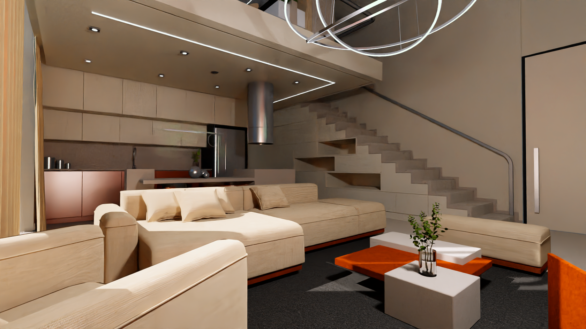
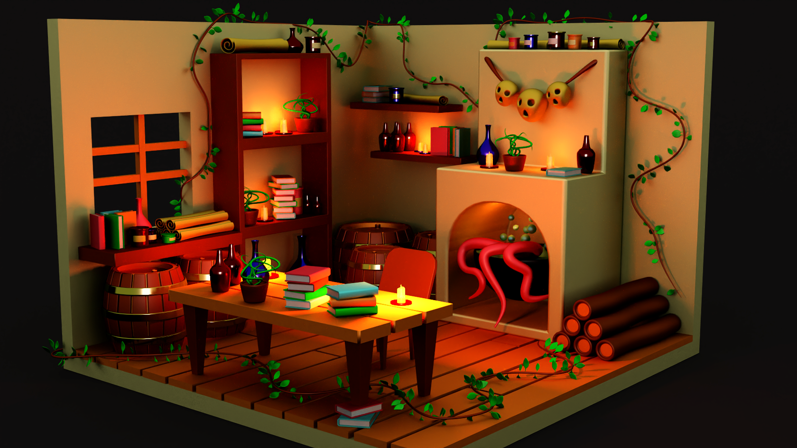
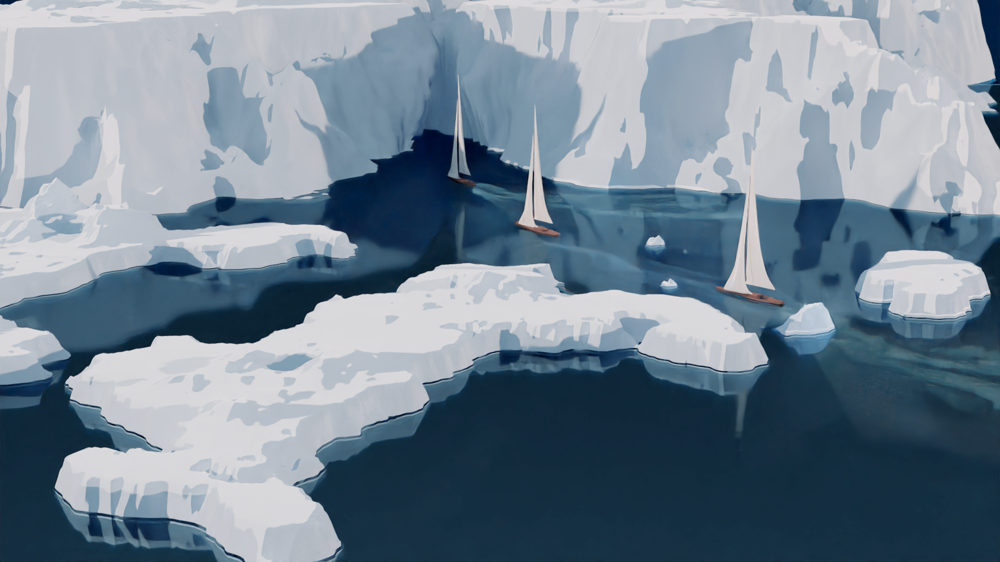
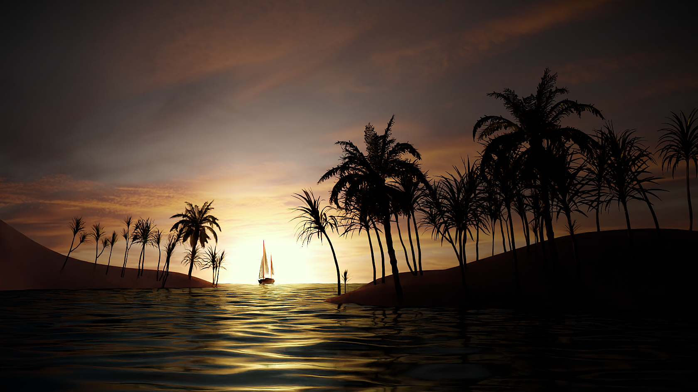

# 🌟 RayTrophi - Gelişmiş Gerçek Zamanlı Ray Tracing Motoru

<div align="center">


**Hibrit CPU/GPU rendering ile yüksek performanslı, üretime hazır ray tracing renderleyici**

[Özellikler](#-özellikler) • [Hızlı Başlangıç](#-hızlı-başlangıç) • [Mimari](#-mimari) • [Performans](#-performans) • [Galeri](#-galeri)

</div>

---

## 📖 Genel Bakış

**RayTrophi**, mimari görselleştirme, ürün renderlaması ve gerçek zamanlı grafik için tasarlanmış, fiziksel tabanlı son teknoloji bir ray tracing motorudur. CPU rendering'in esnekliğini NVIDIA OptiX aracılığıyla GPU hızlandırmasının gücüyle birleştirir.

### 🎯 Temel Özellikler

- **Hibrit Rendering**: CPU (Embree/Özel BVH) ve GPU (OptiX) hızlandırması arasında sorunsuz geçiş
- **Üretime Hazır**: Principled BSDF, gelişmiş materyaller, volumetric, subsurface scattering
- **Yüksek Performans**: Optimize BVH yapısı (<1s 3.3M üçgen için), çok thread'li rendering
- **Gerçek Zamanlı Önizleme**: ImGui ile interaktif UI, canlı parametre ayarlamaları
- **Endüstri Standardı**: AssImp yükleyici 40+ 3D format destekler (GLTF, FBX, OBJ, vb.)

---

## ✨ Özellikler

### 🎨 Rendering Yetenekleri

- **Materyaller**
  - ✅ Principled BSDF (Disney-tarzı uber-shader)
  - ✅ Lambertian, Metal, Dielektrik
  - ✅ Gürültü tabanlı yoğunluk ile volumetrik rendering
  - ✅ Subsurface Scattering (SSS)
  - ✅ Clearcoat, Anizotropik materyaller
  
- **Aydınlatma**
  - ✅ Nokta ışıklar, Yönlü ışıklar
  - ✅ Alan ışıkları (mesh tabanlı)
  - ✅ Işık yayan materyaller
  - ✅ Environment/HDRI aydınlatma
  - ✅ Çoklu önem örneklemesi ile yumuşak gölgeler

- **Gelişmiş Özellikler**
  - ✅ Derinlik Alanı (DOF)
  - ✅ Hareket Bulanıklığı
  - ✅ Intel Open Image Denoise (OIDN) entegrasyonu
  - ✅ Ton haritalama & post-processing
  - ✅ Kemik tabanlı iskelet animasyonu

### 🚀 Performans & Optimizasyon

- **Çoklu BVH Desteği**
  - Embree BVH (Intel, üretim seviyesi)
  - Özel ParallelBVH (SAH tabanlı, OpenMP paralelleştirilmiş)
  - OptiX GPU hızlandırma yapısı

- **Optimizasyonlar**
  - SIMD vektör işlemleri
  - Çok thread'li tile tabanlı rendering
  - Progressive refinement (ilerlemeli iyileştirme)
  - Adaptive sampling (uyarlanabilir örnekleme)
  - Bellek optimize üçgen gösterimi (146 byte/üçgen)

### 🖥️ Kullanıcı Arayüzü

- Modern ImGui tabanlı arayüz
- Gerçek zamanlı parametre ayarlama
- Sahne hiyerarşi görüntüleyici
- Materyal editörü
- Performans metrikleri (FPS, rays/s, bellek kullanımı)
- Çoklu render backend seçimi

---

## 🚦 Hızlı Başlangıç

### Ön Gereksinimler

**Gerekli:**
- **Visual Studio 2022** (MSVC v143) - **ÖNERİLEN DERLEME SİSTEMİ**
- Windows 10/11 (x64)
- CMake 3.20+ (opsiyonel, VS2022 tercih edilir)

**Opsiyonel (GPU rendering için):**
- RTX desteği olan NVIDIA GPU
- CUDA Toolkit 12.0+
- OptiX 7.x SDK

### 📦 Bağımlılıklar

Tüm bağımlılıklar otomatik yönetilir:
- SDL2 (grafik çıktısı)
- Embree 4.x (CPU BVH)
- AssImp 5.x (model yükleme)
- ImGui (UI)
- OpenMP (paralelleştirme)
- stb_image (texture yükleme)
- Intel OIDN (denoising)
- CUDA/OptiX (GPU rendering - opsiyonel)

### 🔨 Derleme Talimatları

#### **Yöntem 1: Visual Studio 2022 (ÖNERİLİR)**

```bash
# 1. Repository'yi klonlayın
git clone https://github.com/maxkemal/RayTrophi.git
cd RayTrophi/raytrac_sdl2

# 2. Solution'ı açın
# raytrac_sdl2.vcxproj dosyasına çift tıklayın veya Visual Studio 2022'de açın

# 3. Derleyin
# Konfigürasyonu "Release" ve platformu "x64" olarak ayarlayın
# Build > Build Solution (Ctrl+Shift+B)

# 4. Çalıştırın
# Exe dosyası şurada olacak: x64/Release/raytracing_render_code.exe
```

**Not**: Tüm bağımlılıklar (DLL'ler, kaynaklar) derleme sistemi tarafından otomatik olarak çıktı dizinine kopyalanır.

#### **Yöntem 2: CMake (Bilinen Sorunlar - Aşağıya bakın)**

```bash
mkdir build && cd build
cmake .. -G "Visual Studio 17 2022" -A x64
cmake --build . --config Release
```

⚠️ **CMake Bilinen Sorun**: SDL ile CPU rendering'de ekran güncelleme hatası var. Kararlı CPU rendering için VS2022 .vcxproj derlemesini kullanın.

### ▶️ Çalıştırma

```bash
cd x64/Release
raytracing_render_code.exe
```

UI açılacaktır. Model içe aktarmak için File > Load Scene kullanın (GLTF önerilir).

---

## 🏗️ Mimari

### Proje Yapısı

```
RayTrophi/
├── raytrac_sdl2/                  # Ana proje
│   ├── source/
│   │   ├── cpp_file/              # İmplementasyon dosyaları
│   │   │   ├── Renderer.cpp       # Ana rendering döngüsü
│   │   │   ├── EmbreeBVH.cpp     # Embree BVH wrapper
│   │   │   ├── ParallelBVHNode.cpp # Özel SAH BVH
│   │   │   ├── OptixWrapper.cpp   # OptiX GPU backend
│   │   │   ├── AssimpLoader.cpp   # Model/texture yükleyici
│   │   │   ├── PrincipledBSDF.cpp # Disney BSDF
│   │   │   └── ...
│   │   ├── header/                # Header dosyaları
│   │   │   ├── Ray.h, Vec3.h     # Matematiksel primitifler
│   │   │   ├── Material.h         # Materyal base
│   │   │   ├── Triangle.h         # Optimize üçgen
│   │   │   ├── Camera.h           # Kamera & DOF
│   │   │   └── ...
│   │   ├── imgui/                 # ImGui kütüphanesi
│   │   └── res/                   # Kaynaklar (ikonlar, vb.)
│   ├── raytrac_sdl2.vcxproj      # Visual Studio projesi
│   ├── CMakeLists.txt             # CMake derleme (sorunlu)
│   └── raygen.ptx                 # OptiX shader
└── README.md                      # Bu dosya
```

### Temel Bileşenler

1. **Renderer** (`Renderer.cpp`)
   - Tile tabanlı çok thread'li rendering
   - Progressive refinement
   - Denoising entegrasyonu

2. **BVH Sistemleri**
   - **EmbreeBVH**: Endüstri standardı, hız için optimize
   - **ParallelBVHNode**: Özel SAH tabanlı, OpenMP paralel build
   - **OptiX BVH**: GPU hızlandırmalı yapı

3. **Materyal Sistemi** (`Material.h`, `PrincipledBSDF.cpp`)
   - Modüler özellik tabanlı materyaller
   - Texture desteği (albedo, roughness, metallic, normal, emission)
   - sRGB/Linear renk uzayı işleme

4. **OptixWrapper** (`OptixWrapper.cpp`)
   - CUDA/OptiX backend
   - SBT (Shader Binding Table) yönetimi
   - Texture object önbellekleme

5. **AssimpLoader** (`AssimpLoader.cpp`)
   - 40+ format desteği
   - Gömülü texture çıkarma
   - Materyal dönüşümü Principled BSDF'ye

---

## ⚡ Performans

### BVH İnşası (3.3M Üçgen)

| BVH Türü       | İnşa Süresi | Kalite | Kullanım Alanı        |
|----------------|-------------|--------|-----------------------|
| Embree         | **872 ms**  | Yüksek | Üretim renderlaması   |
| ParallelBVH    | ~2000 ms    | Yüksek | Özel araştırma/debug  |
| OptiX (GPU)    | ~150 ms     | Çok Yüksek | Gerçek zamanlı GPU |

### Rendering Hızı

- **CPU (Embree)**: ~1-5 milyon rays/s (16 thread)
- **GPU (OptiX RTX 3080)**: ~100-500 milyon rays/s
- **Bellek**: 146 byte/üçgen (optimize düzen)

### Uygulanan Optimizasyonlar

- ✅ Doğrudan Embree buffer yazımları (ara vektörler yok)
- ✅ `reserve()` ile vektör ön tahsisi
- ✅ İki geçişli BVH inşası (say → tahsis et → oluştur)
- ✅ Embree build kalite ayarlaması (hız için MEDIUM)
- ✅ MaterialManager üzerinden Material ID araması (Triangle'da shared_ptr yok)

---

## 🎨 Galeri

### 🎬 Demo Reel

[](https://www.youtube.com/watch?v=Vcn4Dp0ICxk)

**[▶️ Demo Reel'i YouTube'da İzleyin](https://www.youtube.com/watch?v=Vcn4Dp0ICxk)**

### 🖼️ Render Örnekleri

<div align="center">

#### Mimari Görselleştirme

<p><i>Gelişmiş aydınlatma ile karmaşık mimari sahne - 3.3M üçgen, Embree BVH</i></p>

#### Ürün Renderlaması

<p><i>Volumetrik aydınlatma ve subsurface scattering ile iç mekan tasarımı</i></p>

#### GPU Hızlandırmalı Rendering

<p><i>OptiX ile gerçek zamanlı GPU rendering - 500M+ rays/saniye</i></p>

#### Stilize Rendering

<p><i>Özel materyaller ve prosedürel texture'lar ile stilize ejderha</i></p>

#### CPU Path Tracing

<p><i>Progressive refinement ile saf CPU path tracing</i></p>

#### Materyaller & Texture'lar

<p><i>PBR texture'lar ile Principled BSDF materyalleri</i></p>

#### Açık Hava Sahnesi

<p><i>Doğal aydınlatma ile açık hava ortamı</i></p>

#### Gerçek Zamanlı UI

<p><i>Canlı parametre ayarlamaları ile interaktif ImGui arayüzü</i></p>

</div>

---

## 🛠️ Kaynaktan Derleme - Detaylı Kılavuz

### Bağımlılık Kurulumu

**Otomatik (önerilir):**
Visual Studio projesi bağımlılıkları vcpkg veya manuel yollar ile yönetir.

**Manuel:**
1. SDL2, Embree, AssImp'i resmi kaynaklardan indirin
2. Proje özelliklerinde include/library yollarını güncelleyin

### Derleme Konfigürasyonları

- **Debug**: Tam semboller, daha yavaş (~10x)
- **Release**: Optimize, üretim kullanımı
- **RelWithDebInfo**: Optimize + semboller (profiling)

### CMake vs Visual Studio

| Özellik                  | VS2022 .vcxproj | CMake         |
|--------------------------|-----------------|---------------|
| CPU Rendering (SDL)      | ✅ Çalışıyor    | ⚠️ Hatalı     |
| GPU Rendering (OptiX)    | ✅ Çalışıyor    | ✅ Çalışıyor  |
| Bağımlılık Yönetimi      | ✅ Mükemmel     | ⚠️ Manuel     |
| Derleme Hızı             | Hızlı           | Daha yavaş    |
| **Öneri**                | **BUNU KULLAN** | Deneysel      |

**Neden VS2022?**
- Tüm bağımlılıklar önceden yapılandırılmış
- Kaynak dosyaları (ikonlar, PTX) otomatik kopyalanır
- CPU rendering'de SDL refresh hatası yok
- Daha iyi debugging deneyimi

---

## 📚 Kullanım Örnekleri

### Temel Rendering

```cpp
#include "Renderer.h"
#include "SceneData.h"

int main() {
    Renderer renderer(1920, 1080, 8, 128);
    SceneData scene;
    OptixWrapper optix;
    
    // Sahne yükle
    renderer.create_scene(scene, &optix, "path/to/model.gltf");
    
    // Render et
    SDL_Surface* surface = /* ... */;
    renderer.render_image(surface, scene, /* ... */);
    
    return 0;
}
```

### BVH Backend Değiştirme

```cpp
// Embree kullan (en hızlı)
renderer.rebuildBVH(scene, true);  // use_embree = true

// Özel ParallelBVH kullan
renderer.rebuildBVH(scene, false); // use_embree = false
```

### Materyal Oluşturma

```cpp
auto mat = std::make_shared<PrincipledBSDF>();
mat->albedoProperty.constant_value = Vec3(0.8, 0.1, 0.1); // Kırmızı
mat->roughnessProperty.constant_value = Vec3(0.3, 0.3, 0.3);
mat->metallicProperty.constant_value = Vec3(1.0, 1.0, 1.0); // Metalik
```

---

## 🐛 Bilinen Sorunlar & Sınırlamalar

### Derleme Sistemi
- ⚠️ **CMake derlemesinde CPU rendering'de SDL ekran güncelleme hatası var** → Bunun yerine VS2022 kullanın
- DLL bağımlılıkları .exe ile aynı klasörde olmalı

### Rendering
- OptiX, NVIDIA RTX GPU gerektirir
- Çok büyük sahneler (>10M üçgen) bellek sorunlarına neden olabilir
- Denoising Intel CPU (OIDN) gerektirir veya yavaş olabilir

### Platform
- Şu anda sadece Windows (SDL2, DirectX bağımlılıkları)
- Linux/macOS desteği portlama gerektirir

---

## 🗺️ Yol Haritası

- [ ] Daha hızlı BVH inşası için Binned SAH
- [ ] Index tabanlı BVH (vektör kopyalamayı kaldır)
- [ ] SBVH (Spatial BVH splits)
- [ ] Linux/macOS desteği
- [ ] Vulkan backend (OptiX alternatifi)
- [ ] Ağ rendering (dağıtık ray tracing)
- [ ] USD format desteği
- [ ] Işık yolu görselleştirme/debugging

---

## 🤝 Katkıda Bulunma

Katkılar memnuniyetle karşılanır! İlgi alanları:

- Performans optimizasyonları
- Yeni materyal modelleri
- Ek 3D format desteği
- Hata düzeltmeleri
- Dokümantasyon iyileştirmeleri

**Nasıl katkıda bulunulur:**
1. Repository'yi fork edin
2. Bir özellik branch'i oluşturun (`git checkout -b feature/muhteşem-özellik`)
3. Değişikliklerinizi commit edin (`git commit -m 'Muhteşem özellik ekle'`)
4. Branch'e push yapın (`git push origin feature/muhteşem-özellik`)
5. Bir Pull Request açın

---

## 📝 Lisans

Bu proje MIT Lisansı altında lisanslanmıştır - detaylar için [LICENSE](source/LICENSE) dosyasına bakın.

---

## 🙏 Teşekkürler

- **Embree** - Intel'in yüksek performanslı ray tracing çekirdekleri
- **OptiX** - NVIDIA'nın GPU ray tracing motoru
- **AssImp** - Open Asset Import Library
- **ImGui** - Dear ImGui kullanıcı arayüzü için
- **SDL2** - Simple DirectMedia Layer
- **Intel OIDN** - Open Image Denoise
- **stb** - Sean Barrett'ın public domain kütüphaneleri

---

## 👤 Yazar

**Kemal** - [@maxkemal](https://github.com/maxkemal)

---

## 📧 İletişim & Destek

- **Sorunlar**: [GitHub Issues](https://github.com/maxkemal/RayTrophi/issues)
- **Tartışmalar**: [GitHub Discussions](https://github.com/maxkemal/RayTrophi/discussions)

---

<div align="center">

**⭐ Faydalı bulduysanız bu repository'ye yıldız verin!**

❤️ ve bol ☕ ile yapıldı

</div>
