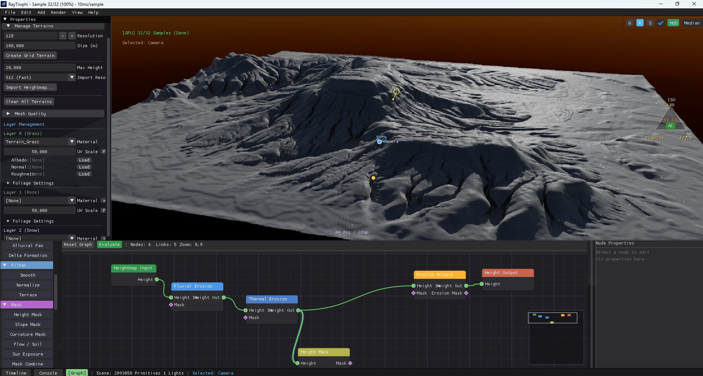
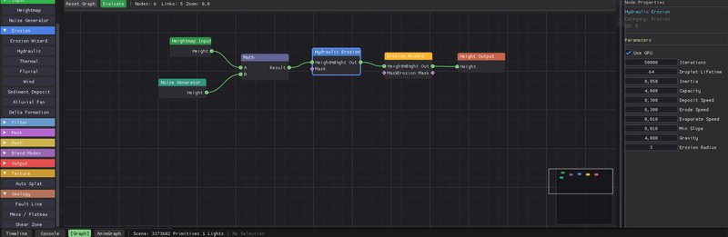
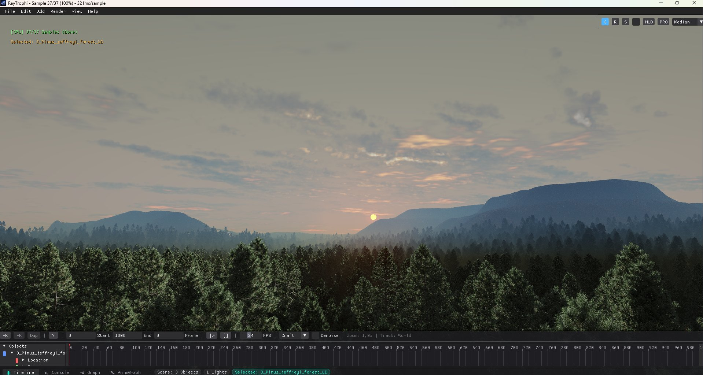
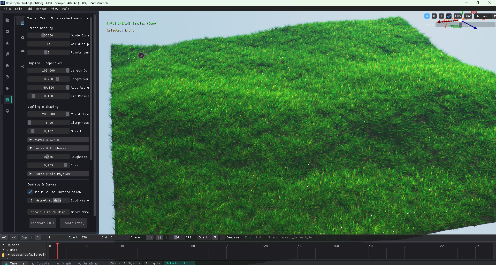
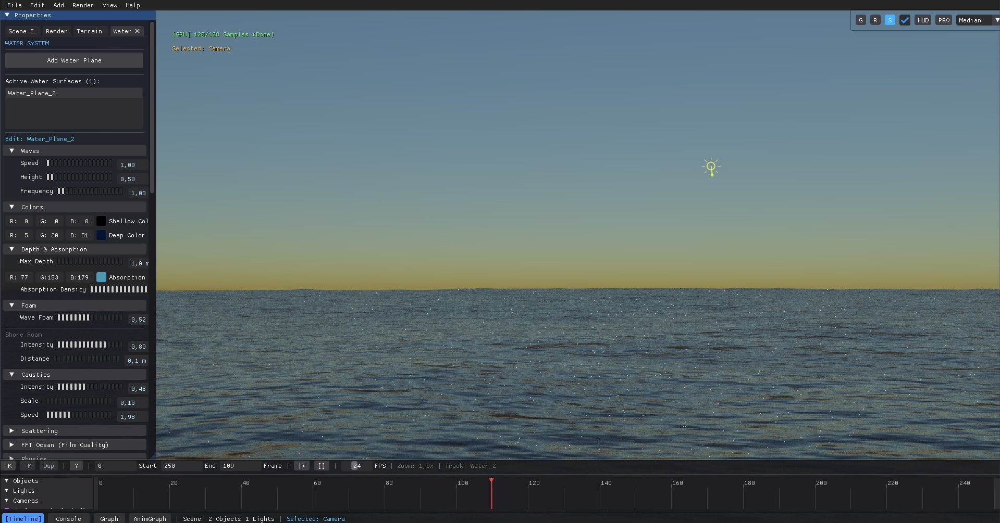
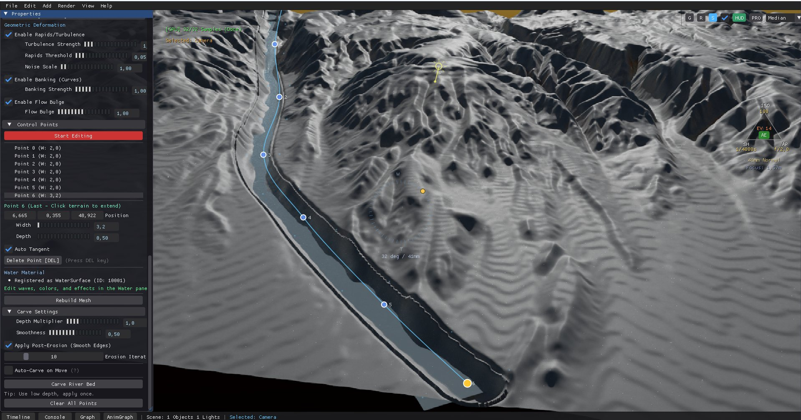
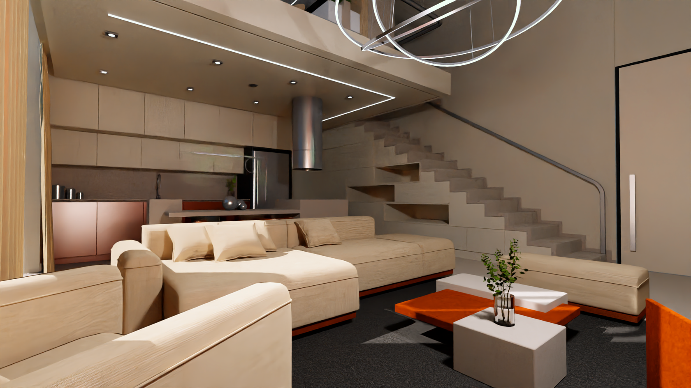
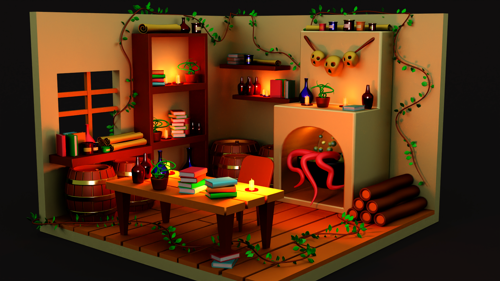
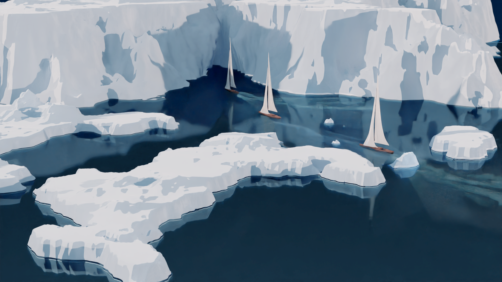
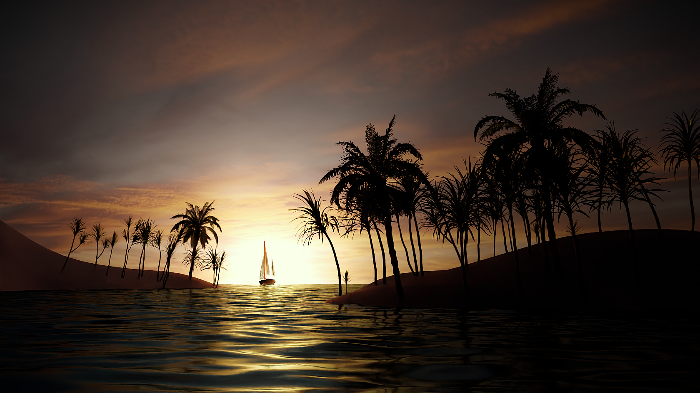

# 🌟 RayTrophi - Gelişmiş Gerçek Zamanlı Ray Tracing Motoru

<div align="center">


**Hibrit CPU/GPU rendering ile yüksek performanslı, üretime hazır ray tracing renderleyici**

[](https://www.youtube.com/watch?v=Y03YvX5EHEM)
**[▶️ Showcase Videosunu YouTube'da İzleyin](https://www.youtube.com/watch?v=Y03YvX5EHEM)**

[Özellikler](#-özellikler) • [Hızlı Başlangıç](#-hızlı-başlangıç) • [Mimari](#-mimari) • [Performans](#-performans) • [Galeri](#-galeri)

</div>

---

## 📖 Genel Bakış

**RayTrophi**, mimari görselleştirme, ürün renderlaması ve gerçek zamanlı grafik için tasarlanmış, fiziksel tabanlı son teknoloji bir ray tracing motorudur. CPU rendering'in esnekliğini NVIDIA OptiX aracılığıyla GPU hızlandırmasının gücüyle birleştirir.

### 🎯 Temel Özellikler

- **Hibrit Rendering**: CPU (Embree/Özel BVH) ve GPU (OptiX & Vulkan) hızlandırması arasında sorunsuz geçiş

- **Üretime Hazır**: Principled BSDF, gelişmiş materyaller, volumetric, subsurface scattering
- **Yüksek Performans**: Optimize BVH yapısı (<1s 3.3M üçgen için), %75 bellek tasarruflu üçgen yapısı
- **Gerçek Zamanlı Önizleme**: ImGui ile modern interaktif UI, animasyon timeline
- **Endüstri Standardı**: AssImp yükleyici 40+ 3D format destekler (GLTF, FBX, OBJ, vb.)

---

## 📊 Proje İstatistikleri
<!-- STATS_START -->
| Metric | Value |
| :--- | :--- |
| **Files (Source)** | 249 |
| **Lines of Code** | 136,184 |
| **UI Control Points** | 1,015+ |
| **Last Updated** | 2026-03-10 |
<!-- STATS_END -->

Tam Teknik Rapor: [ARCHITECTURE_TR.md](ARCHITECTURE_TR.md)

---


## ✨ Özellikler

### 🎨 Rendering Yetenekleri

- **Materyaller**
  - ✅ Principled BSDF (Disney-tarzı uber-shader)
  - ✅ Lambertian, Metal, Dielektrik
  - ✅ Gürültü tabanlı yoğunluk ile volumetrik rendering
  - ✅ Subsurface Scattering (SSS)
  - ✅ Clearcoat, Anizotropik materyaller
  - ✅ **Saç Sistemi**: GPU hızlandırmalı saç/kıl simülasyonu ve renderlaması
  
- **Aydınlatma**
  - ✅ Nokta ışıklar, Yönlü ışıklar
  - ✅ Alan ışıkları (mesh tabanlı)
  - ✅ Işık yayan materyaller
  - ✅ **HDR/EXR Environment Haritaları** (equirectangular projeksiyon)
  - ✅- **Gelişmiş Nishita Gökyüzü Modeli**: 
  - Blender uyumlu fiziksel atmosfer parametreleri (Air, Dust, Ozone, Altitude).
  - **Gece/Gündüz Döngüsü**: Prosedürel yıldızlar ve ay ile otomatik geçiş.
  - **Ay Özellikleri**: Ufukta büyüme efekti, kızıl renk değişimi, atmosferik sönümleme ve ay evreleri.
  - **Güneş Halesi**: Yüksek Mie Anisotropy (0.98) ile gerçekçi atmosferik parlamalar.
  - **Işık Senkronizasyonu**: Sahnedeki Directional Light'ı otomatik olarak güneş pozisyonuna kilitler.çılım)
  - ✅ Çoklu önem örneklemesi ile yumuşak gölgeler

- **Gelişmiş Özellikler**
  - ✅ **Birikimli (Accumulative) Render**: Gürültüsüz, yüksek kaliteli çıktı için zamanla biriken örnekleme
  - ✅ **Adaptif Örnekleme (Adaptive Sampling)**: Gürültülü bölgelere odaklanan akıllı render motoru
  - ✅ Derinlik Alanı (DOF)
  - ✅ Hareket Bulanıklığı (Motion Blur)
  - ✅ Intel Open Image Denoise (OIDN) entegrasyonu
  - ✅ Ton haritalama & post-processing
  - 🧪 **[DENEYSEL] Vulkan RT Backend** *(Aktif Geliştirme)*: `VK_KHR_ray_tracing_pipeline` üzerine inşa edilmiş donanım tabanlı ray tracing mimarisi. Compute shader ile GPU hızlandırmalı iskelet animasyonu (skinning), dinamik geometri için TLAS/BLAS refit, kalıcı descriptor set yönetimi ve tek komut tamponu ile trace+readback mimarisi. Vulkan bağımlılıkları (`vulkan-1.dll`) veya desteklenmeyen GPU'larda otomatik olarak OptiX veya CPU moduna geçiş yapar.

  <details>
  <summary>🧪 <b>Vulkan Backend — Özellik Uyumluluk Tablosu</b> (genişlet)</summary>

  | Özellik | OptiX | Vulkan RT | Not |
  |---------|:-----:|:---------:|-----|
  | Principled BSDF | ✅ | ✅ | Tam uyumlu |
  | Lambertian / Metal / Dielektrik | ✅ | ✅ | Tam uyumlu |
  | Subsurface Scattering (SSS) | ✅ | ✅ | Küçük renk tonu farkı |
  | Clearcoat & Anizotropik | ✅ | ✅ | Tam uyumlu |
  | Volumetrik Render | ✅ | 🧪 | Yoğunluk hesabında ufak farklar |
  | **Saç Sistemi (Hair)** | ✅ | 🧪 | Shader hesaplama farkları |
  | HDR / EXR Environment | ✅ | ✅ | Tam uyumlu |
  | Nishita Gökyüzü & Gece/Gündüz | ✅ | ✅ | Tam uyumlu |
  | Volumetrik Bulutlar | ✅ | 🧪 | Saçılım hesabında küçük farklar |
  | **Su / Okyanus (FFT)** | ✅ | 🧪 | Dalga refleksiyon farkları |
  | Kemik Animasyon (GPU Skinning) | ✅ | ✅ | Vulkan compute shader |
  | Derinlik Alanı (DOF) | ✅ | ✅ | Tam uyumlu |
  | Hareket Bulanıklığı (Motion Blur) | ✅ | ✅ | Tam uyumlu |
  | Yumuşak Gölgeler (MIS) | ✅ | ✅ | Tam uyumlu |
  | Alan Işıkları | ✅ | ✅ | Tam uyumlu |
  | Ton Haritalama & Post-FX | ✅ | ✅ | Tam uyumlu |
  | OIDN Denoising | ✅ | ✅ | Tam uyumlu |
  | Adaptif Örnekleme | ✅ | ✅ | Tam uyumlu |
  | Birikimli (Progressive) Render | ✅ | ✅ | Tam uyumlu |

  > **Lejant:** ✅ Tam destek &nbsp;|&nbsp; 🧪 Destekleniyor, küçük çıktı farkları olabilir

  </details>

  - ✅ **Gelişmiş Animasyon**: Kemik (bone) animasyonu, quaternion interpolasyonu ve timeline kontrolü
  - ✅ **Gelişmiş Bulut Aydınlatma Kontrolleri**:
    - Işık Adımları (Light Steps): Volumetrik bulut kalitesi için
    - Gölge Yoğunluğu (Shadow Strength): Gerçekçi bulut gölgeleri
    - Ortam Aydınlatması (Ambient Strength): Bulut taban aydınlatması
    - Gümüş Yoğunluğu (Silver Intensity): Güneş kenarı efektleri
    - Bulut Absorpsiyonu (Absorption): Işık geçirgenlik kontrolü
  - ✅ **Tam Undo/Redo Sistemi** (YENİ v1.2):
    - Obje dönüştürmeleri (taşıma, döndürme, ölçekleme)
    - Obje silme ve kopyalama
    - **Işık dönüştürmeleri** (taşıma, döndürme, ölçekleme)
    - **Işık ekleme/silme/kopyalama**
    - Klavye kısayolları: Ctrl+Z (Geri Al), Ctrl+Y (Yinele)

### 🚀 Performans & Optimizasyon

- **Çoklu BVH Desteği**
  - Embree BVH (Intel, üretim seviyesi)
  - Özel ParallelBVH (SAH tabanlı, OpenMP paralelleştirilmiş)
  - OptiX GPU hızlandırma yapısı
  - 🧪 Vulkan RT TLAS/BLAS mimarisi — dinamik refit, compute skinning, tek-gönderim pipeline *(Deneysel)*

- **Optimizasyonlar**
- **Optimizasyonlar**
  - SIMD vektör işlemleri
  - Çok thread'li tile tabanlı rendering
  - Progressive refinement (ilerlemeli iyileştirme)
  - **Bellek Optimizasyonu**: Üçgen başına 612 byte -> 146 byte'a düşürüldü (%75 tasarruf)
  - **Güvenli Texture Sistemi**: Unicode dosya yolları ve bozuk formatlar için crash korumalı yükleyici
  - Önbellekli Texture Yönetimi (Cache Hit/Miss optimizasyonu)

### 🖥️ Kullanıcı Arayüzü

- Modern ImGui tabanlı koyu tema (Dark UI)
- **Animasyon Timeline Paneli**: Play/Pause, Scrubbing, Kare atlama
- Render Kalite Presetleri (Düşük, Orta, Yüksek, Ultra)
- Dinamik Çözünürlük Ayarları (Resolution Scaling)
- Sahne hiyerarşi görüntüleyici ve Materyal editörü
- Performans metrikleri (FPS, rays/s, bellek kullanımı)

---

## 🛠️ Prosedürel Araçlar ve Sistemler

### 🏔️ Gelişmiş Arazi Editörü


- **Şekillendirme Fırçaları**: Arazi geometrisini gerçek zamanlı olarak yükseltmek, alçaltmak, yumuşatmak ve düzleştirmek için sezgisel fırçalar.
- **Hidrolik & Nehir (Fluvial) Erozyonu**: 
  - Gerçekçi su akışını ve tortu taşınımını simüle edin
  - Doğal görünümlü nehir yatakları ve vadileri otomatik oluşturun
  - Erozyon gücünü, yağmur miktarını ve çözünürlüğü kontrol edin
- **Heightmap Desteği**: Harici iş akışları (World Machine, Gaea) için 16-bit yükseklik haritası içe/dışa aktarımı.
- **Düğüm (Node) Tabanlı İş Akışı**:  Güçlü bir düğüm grafiği editörü kullanarak tahribatsız (non-destructive) arazi oluşturma. Gürültüleri, filtreleri ve maskeleri birleştirin.

### 🌿 Prosedürel Bitki Örtüsü & Dağılım


- **GPU Instancing**: OptiX donanım hızlandırması kullanarak milyonlarca çim, ağaç ve kayayı sıfır performans kaybıyla renderlayın.
- **Akıllı Dağılım (Smart Scattering)**: 
  - Kural tabanlı yerleşim (eğim, yükseklik, doku maskesi)
  - Örneklerin üst üste binmesini önlemek için çarpışma (collision) engelleme
- **Boyama Modu**: Fırça araçlarını kullanarak ormanları veya belirli ayrıntıları manuel olarak boyayın.
- **Dinamik Rüzgar**: Tüm bitki örtüsü küresel rüzgar parametrelerine (güç, yön, ani rüzgar) tepki verir.

### 💇 Saç & Kıl Sistemi (Yeni!)



- **GPU Simülasyon & Render**: Gerçek zamanlı performans için tamamen NVIDIA OptiX ile hızlandırılmıştır.
- **Tarama (Grooming) Fırçaları**:
  - **Tarak (Comb)**: Saç yönünü doğal bir şekilde şekillendirin
  - **Kes/Uzat (Cut/Grow)**: Uzunluğu etkileşimli olarak ayarlayın
  - **Yumuşat (Smooth)**: Saç tellerini gevşetin/düzeltin
- **Fizik Entegrasyonu**: Saç telleri karakter ağlarıyla (mesh) çarpışır ve yerçekimine/kuvvetlere tepki verir.
- **Materyal Desteği**: Gerçekçi renderlama için Melanin tabanlı saç BSDF materyali.

### 🌊 Gerçekçi Su & Okyanus


- **FFT Okyanus Simülasyonu**: Köpük oluşumu ile Hızlı Fourier Dönüşümü (FFT) tabanlı derin okyanus dalgaları.
- **Caustics**: Deniz tabanında gerçekçi ışık kırılması ve kaustik desenleri.
- **Su Altı Volumetrikleri**: Derinliğe bağlı sis yoğunluğu ve ışık emilimi (absorption).

### 🏞️ Nehir Aracı


- **Spline Tabanlı Oluşturma**: Sezgisel bezier eğrileri kullanarak nehirler çizin.
- **Otomatik Oyma (Auto-Carving)**: Nehirler yollarını araziye otomatik olarak oyar.
- **Akış Haritalama (Flow Mapping)**: Su dokusu, spline yönü boyunca doğal bir şekilde akar.
- **Fizik Etkileşimi**: Nesneler nehir akış hızına göre sürüklenir ve yüzer.

---

## 🚦 Hızlı Başlangıç

### Ön Gereksinimler

**Gerekli:**
- **Visual Studio 2022** (MSVC v143) - **ÖNERİLEN DERLEME SİSTEMİ**
- Windows 10/11 (x64)
- CMake 3.20+ (opsiyonel, VS2022 tercih edilir)

**Opsiyonel (GPU rendering için):**
- NVIDIA GPU (SM 5.0+): GTX 9xx, 10xx, 16xx veya RTX serisi
- CUDA Toolkit 12.0+
- OptiX 7.x SDK
- Vulkan SDK 1.3+ (Vulkan rendering desteği için)

**GPU Uyumluluğu:**
| GPU Serisi | Mimari | Mod | Performans |
|------------|--------|-----|------------|
| RTX 40xx | Ada Lovelace | Donanım RT | ⚡ En Hızlı |
| RTX 30xx | Ampere | Donanım RT | ⚡ Çok Hızlı |
| RTX 20xx | Turing | Donanım RT | ⚡ Hızlı |
| GTX 16xx | Turing | Compute | 🔶 İyi |
| GTX 10xx | Pascal | Compute | 🔶 Orta |
| GTX 9xx | Maxwell | Compute | 🔶 Yavaş |

### 📦 Bağımlılıklar

Tüm bağımlılıklar otomatik yönetilir:
- SDL2 (grafik çıktısı)
- Embree 4.x (CPU BVH)
- AssImp 5.x (model yükleme)
- ImGui (UI)
- OpenMP (paralelleştirme)
- stb_image (HDR/texture yükleme)
- **TinyEXR** (EXR format desteği)
- Intel OIDN (denoising)
- CUDA/OptiX/Vulkan (GPU rendering - opsiyonel)

| Ortam Değişkeni (Env Var) | Açıklama |
|----------------------|-------------|
| `SDL2_ROOT`          | SDL2 Kök Dizini | 
| `OPTIX_ROOT`         | OptiX SDK Dizini | 
| `EMBREE_ROOT`        | Embree Kök Dizini | 
| `OIDN_ROOT`          | Intel Open Image Denoise Dizini |
| `ASSIMP_ROOT`        | Assimp Kök Dizini | 
| `CUDA_PATH`          | CUDA Toolkit Dizini | 
| `VULKAN_SDK`         | Vulkan SDK Dizini | 

### 🔨 Derleme Talimatları

#### **Yöntem 1: Visual Studio 2022 (ÖNERİLİR)**

```bash
# 1. Repository'yi klonlayın
git clone https://github.com/maxkemal/RayTrophi.git
cd RayTrophi/raytrac_sdl2

# 2. Solution'ı açın
# raytrac_sdl2.vcxproj dosyasına çift tıklayın veya Visual Studio 2022'de açın

# 3. Derleyin
# Konfigürasyonu "Release" ve platformu "x64" olarak ayarlayın
# Build > Build Solution (Ctrl+Shift+B)

# 4. Çalıştırın
# Exe dosyası şurada olacak: x64/Release/raytracing_render_code.exe
```

**Not**: Tüm bağımlılıklar (DLL'ler, kaynaklar) derleme sistemi tarafından otomatik olarak çıktı dizinine kopyalanır.

#### **Yöntem 2: CMake (Bilinen Sorunlar - Aşağıya bakın)**

```bash
mkdir build && cd build
cmake .. -G "Visual Studio 17 2022" -A x64
cmake --build . --config Release
```

⚠️ **CMake Bilinen Sorun**: SDL ile CPU rendering'de ekran güncelleme hatası var. Kararlı CPU rendering için VS2022 .vcxproj derlemesini kullanın.

### ▶️ Çalıştırma

```bash
cd x64/Release
raytracing_render_code.exe
```

UI açılacaktır. Model içe aktarmak için File > Load Scene kullanın (GLTF önerilir).

---

## 🏗️ Mimari

### Proje Yapısı

```
RayTrophi/
├── raytrac_sdl2/                  # Ana proje
│   ├── source/
│   │   ├── src/                   # Modüllere ayrılmış kaynak dosyalar
│   │   │   ├── Core/              # Ana giriş (Main.cpp), Proje Yönetimi
│   │   │   ├── Render/            # Renderer, OptiX Wrapper, BVH İnşası
│   │   │   ├── Scene/             # Sahne Objeleri, Işıklar, Materyaller
│   │   │   ├── Physics/           # Arazi, Su, Gaz Simülasyonu, Fizik Motoru
│   │   │   ├── Device/            # CUDA Kernel (.cu) & GPU Mantığı
│   │   │   ├── UI/                # ImGui Panelleri & Editör Mantığı
│   │   │   ├── Utils/             # Yardımcı Araçlar (Yükleyiciler, Matematik)
│   │   │   └── ...
│   │   ├── include/               # Header (.h) dosyaları
│   │   │   ├── Renderer.h
│   │   │   ├── Material.h
│   │   │   └── ...
│   │   ├── raygen.ptx             # Derlenmiş OptiX kernelleri
│   │   └── ...
│   ├── raytrac_sdl2.vcxproj       # Visual Studio projesi
│   ├── CMakeLists.txt             # CMake derleme yapılandırması
│   └── raygen.ptx                 # OptiX shader
└── README.md                      # Bu dosya
```

### Temel Bileşenler

1. **Renderer** (`src/Render/Renderer.cpp`)
   - Tile (kare) tabanlı çok thread'li rendering
   - Progressive refinement (Aşamalı iyileştirme)
   - Denoising entegrasyonu

2. **BVH Sistemleri**
   - **EmbreeBVH** (`src/Render/EmbreeBVH.cpp`): Endüstri standardı, hız için optimize
   - **ParallelBVHNode** (`src/Render/ParallelBVHNode.cpp`): Özel SAH tabanlı, OpenMP paralel build
   - **OptiX BVH** (`src/Render/OptixWrapper.cpp`): NVIDIA GPU hızlandırmalı yapı
   - **Vulkan RT** (`src/Backend/VulkanBackend.cpp`): Vulkan donanım tabanlı ray tracing yapısı

3. **Materyal Sistemi** (`src/Scene/PrincipledBSDF.cpp`)
   - Modüler özellik tabanlı materyaller
   - Texture desteği (albedo, roughness, metallic, normal, emission)
   - sRGB/Linear renk uzayı işleme

4. **OptixWrapper** (`src/Render/OptixWrapper.cpp`, `src/Device/*.cu`)
   - CUDA/OptiX backend
   - SBT (Shader Binding Table) yönetimi
   - Texture object önbellekleme

5. **Fizik & Prosedürel** (`src/Physics/*`)
   - **TerrainManager**: Hidrolik erozyon, şekillendirme
   - **WaterManager**: FFT Okyanus simülasyonu
   - **EmitterSystem**: Parçacık sistemleri & kuvvetler

---


## 🎨 Galeri

### 🎬 Demo Reel

[](https://www.youtube.com/watch?v=Vcn4Dp0ICxk)

**[▶️ Demo Reel'i YouTube'da İzleyin](https://www.youtube.com/watch?v=Vcn4Dp0ICxk)**

### 🖼️ Render Örnekleri

<div align="center">

#### Mimari Görselleştirme

<p><i>Gelişmiş aydınlatma ile karmaşık mimari sahne - 3.3M üçgen, Embree BVH</i></p>

#### Ürün Renderlaması

<p><i>Volumetrik aydınlatma ve subsurface scattering ile iç mekan tasarımı</i></p>

#### GPU Hızlandırmalı Rendering

<p><i>OptiX ile gerçek zamanlı GPU rendering - 500M+ rays/saniye</i></p>

#### Stilize Rendering

<p><i>Özel materyaller ve prosedürel texture'lar ile stilize ejderha</i></p>

#### CPU Path Tracing

<p><i>Progressive refinement ile saf CPU path tracing</i></p>

#### Materyaller & Texture'lar

<p><i>PBR texture'lar ile Principled BSDF materyalleri</i></p>

#### Açık Hava Sahnesi

<p><i>Doğal aydınlatma ile açık hava ortamı</i></p>

#### Gerçek Zamanlı UI

<p><i>Canlı parametre ayarlamaları ile interaktif ImGui arayüzü</i></p>

</div>

---

## 🛠️ Kaynaktan Derleme - Detaylı Kılavuz

### Bağımlılık Kurulumu

**Otomatik (önerilir):**
Visual Studio projesi bağımlılıkları vcpkg veya manuel yollar ile yönetir.

**Manuel:**
1. SDL2, Embree, AssImp'i resmi kaynaklardan indirin
2. Proje özelliklerinde include/library yollarını güncelleyin

### Derleme Konfigürasyonları

- **Debug**: Tam semboller, daha yavaş (~10x)
- **Release**: Optimize, üretim kullanımı
- **RelWithDebInfo**: Optimize + semboller (profiling)

### CMake vs Visual Studio

| Özellik                  | VS2022 .vcxproj | CMake         |
|--------------------------|-----------------|---------------|
| CPU Rendering (SDL)      | ✅ Çalışıyor    | ✅ Çalışıyor     |
| GPU Rendering (OptiX)    | ✅ Çalışıyor    | ✅ Çalışıyor  |
| Vulkan Rendering (RT)    | ✅ Çalışıyor    | ✅ Çalışıyor  |
| Bağımlılık Yönetimi      | ✅ Mükemmel     | ⚠️ Manuel     |
| Derleme Hızı             | Hızlı           | Daha yavaş    |
| **Öneri**                | **BUNU KULLAN** | Deneysel      |

**Neden VS2022?**
- Tüm bağımlılıklar önceden yapılandırılmış
- Kaynak dosyaları (ikonlar, PTX) otomatik kopyalanır
- CPU rendering'de SDL refresh hatası yok
- Daha iyi debugging deneyimi

---

## 📚 Kullanım Örnekleri

### Temel Rendering

```cpp
#include "Renderer.h"
#include "SceneData.h"

int main() {
    Renderer renderer(1920, 1080, 8, 128);
    SceneData scene;
    OptixWrapper optix;
    
    // Sahne yükle
    renderer.create_scene(scene, &optix, "path/to/model.gltf");
    
    // Render et
    SDL_Surface* surface = /* ... */;
    renderer.render_image(surface, scene, /* ... */);
    
    return 0;
}
```

### BVH Backend Değiştirme

```cpp
// Embree kullan (en hızlı)
renderer.rebuildBVH(scene, true);  // use_embree = true

// Özel ParallelBVH kullan
renderer.rebuildBVH(scene, false); // use_embree = false
```

### Materyal Oluşturma

```cpp
auto mat = std::make_shared<PrincipledBSDF>();
mat->albedoProperty.constant_value = Vec3(0.8, 0.1, 0.1); // Kırmızı
mat->roughnessProperty.constant_value = Vec3(0.3, 0.3, 0.3);
mat->metallicProperty.constant_value = Vec3(1.0, 1.0, 1.0); // Metalik
```

---

## 🐛 Bilinen Sorunlar & Sınırlamalar

### Derleme Sistemi
- ⚠️ **CMake derlemesinde CPU rendering'de SDL ekran güncelleme hatası var** → Bunun yerine VS2022 kullanın
- DLL bağımlılıkları .exe ile aynı klasörde olmalı

### Rendering
- OptiX, SM 5.0+ NVIDIA GPU gerektirir (GTX 9xx veya daha yeni)
- RTX GPU'lar donanım RT core kullanır; GTX GPU'lar compute tabanlı ray tracing kullanır (daha yavaş)
- Çok büyük sahneler (>10M üçgen) bellek sorunlarına neden olabilir
- Denoising Intel OIDN kullanır, NVIDIA GPU'larda CUDA ile hızlandırılır

### Platform
- Şu anda sadece Windows (SDL2, DirectX bağımlılıkları)
- Linux/macOS desteği portlama gerektirir

---

## 🗺️ Yol Haritası

- [ ] Daha hızlı BVH inşası için Binned SAH
- [ ] Index tabanlı BVH (vektör kopyalamayı kaldır)
- [ ] SBVH (Spatial BVH splits)
- [ ] Linux/macOS desteği
- [x] Vulkan backend (OptiX alternatifi)
- [ ] Ağ rendering (dağıtık ray tracing)
- [ ] USD format desteği
- [ ] Işık yolu görselleştirme/debugging

---

## 🤝 Katkıda Bulunma

Katkılar memnuniyetle karşılanır! İlgi alanları:

- Performans optimizasyonları
- Yeni materyal modelleri
- Ek 3D format desteği
- Hata düzeltmeleri
- Dokümantasyon iyileştirmeleri

**Nasıl katkıda bulunulur:**
1. Repository'yi fork edin
2. Bir özellik branch'i oluşturun (`git checkout -b feature/muhteşem-özellik`)
3. Değişikliklerinizi commit edin (`git commit -m 'Muhteşem özellik ekle'`)
4. Branch'e push yapın (`git push origin feature/muhteşem-özellik`)
5. Bir Pull Request açın

---

## 📝 Lisans

Bu proje MIT Lisansı altında lisanslanmıştır - detaylar için [LICENSE](source/LICENSE) dosyasına bakın.

---

## 🙏 Teşekkürler

- **Embree** - Intel'in yüksek performanslı ray tracing çekirdekleri
- **OptiX** - NVIDIA'nın GPU ray tracing motoru
- **AssImp** - Open Asset Import Library
- **ImGui** - Dear ImGui kullanıcı arayüzü için
- **SDL2** - Simple DirectMedia Layer
- **Intel OIDN** - Open Image Denoise
- **stb** - Sean Barrett'ın public domain kütüphaneleri (HDR için stb_image)
- **TinyEXR** - Syoyo Fujita'nın EXR yükleyici kütüphanesi

---

## 👤 Yazar

**Kemal** - [@maxkemal](https://github.com/maxkemal)

---

## 📧 İletişim & Destek

- **Sorunlar**: [GitHub Issues](https://github.com/maxkemal/RayTrophi/issues)
- **Tartışmalar**: [GitHub Discussions](https://github.com/maxkemal/RayTrophi/discussions)

---

<div align="center">

**⭐ Faydalı bulduysanız bu repository'ye yıldız verin!**

❤️ ve bol ☕ ile yapıldı

</div>
