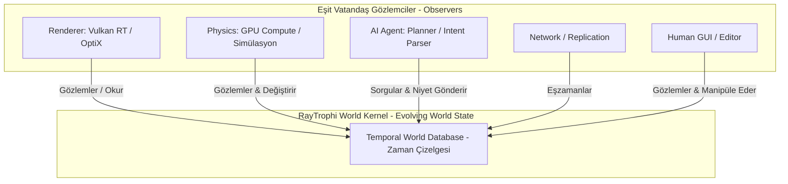

# RayTrophi Engine: Dünya Simülasyon Çekirdeği (World Kernel) Manifestosu ve Geçiş Planı

Bu belge, RayTrophi Studio'nun geleneksel 3D grafik yazılımı sınırlarını aşarak; **nesneleri değil, dünyanın zaman içinde evrilen durumunu (Evolving World State) yöneten bir Dünya Simülasyon Çekirdeğine (World Kernel)** dönüşümünün felsefi manifestosunu, mimari prensiplerini ve pratik teknik uygulama planını içerir.

Render, fizik, yapay zeka ve kullanıcı arayüzü bu ortak dünya durumunun eşit vatandaşlarıdır; hiçbir sistem çekirdeğin tek başına sahibi değildir.

---

# BÖLÜM 1: ULAŞILACAK PARADİGMA: DÜNYA ÇEKİRDEĞİ (THE WORLD KERNEL)

Geleneksel DCC'ler (Blender, Maya) ve oyun motorları (Unreal Engine, Unity), insan kullanıcıların grafik arayüz (GUI) üzerinden butonlara tıklayarak statik sahneleri manipüle etmesi için tasarlanmıştır. Yapay zeka bu sistemlere sonradan eklenmiş ikinci sınıf bir vatandaştır. 

RayTrophi bu eski yaklaşımı tamamen reddeder. RayTrophi bir 3D uygulaması veya oyun motoru kopyası değildir; o bir **Dünya Simülasyon Çekirdeğidir (World Kernel).**

Bu çekirdek mimari, aşağıdaki 10 temel paradigma değişimi üzerine kurulmuştur:

### 1. Geometri Değil "Durum" (State)
Geleneksel yapılar geometri, materyal, ışık ve kamerayı ayrı ve katı sınıflar olarak ele alır. RayTrophi'de her şey bir **Durumdur (State)**. Sahne veri tabanı; *Geometry State*, *Material State*, *Fluid State*, *Semantic State* ve *Animation State* gibi durum bloklarının birleşimidir. Renderer sadece durumu okur (read-only), fizik durumu günceller, yapay zeka ise durumu sorgular. Tüm sistemler aynı ortak dili konuşur.

### 2. Sahne Değil "Dünya" (World)
Geleneksel yapılar geçici ve yerel "Sahneler" (Scene) yönetir. RayTrophi ise **sürekli ve kalıcı bir Dünya (World)** modeli üzerine kuruludur. Simülasyon, rendering, ağ sistemleri (networking) ve serileştirme (serialization) bu ortak dünya modelini paylaşır. Yapay zeka için dünya, zaman içinde evrilen ve kalıcı olan bir simülasyon alanıdır.

### 3. İşlem Değil "Niyet" (Intent)
Yapay zeka (AI) sisteme ham komutlar (örn: "küpü 2 birim sağa kaydır") göndermez. AI sisteme **Niyet (Intent)** bildirir: *"Bu odayı daha aydınlık yap"*, *"Kırık nesneleri yok et"*, *"Kış mevsimini yaza çevir"*. Çekirdek, bu niyetleri alır, **Planlayıcı (Planner)** adımından geçirerek ham işlemlere (Transactions) derler ve GPU üzerinde paralel olarak yürütür. Bu, birden fazla AI ajanının aynı dünyada iş birliği yapmasını sağlar.

### 4. Bileşen Değil "Yetenek" (Capability)
Nesnelerin "Ne olduğu" (Component) değil, "Ne yapabildiği" (**Capability**) önemlidir. AI, nesneleri sınıflarına göre değil, yeteneklerine göre sorgular ve manipüle eder:
*   `Reflective` (Yansıtıcı)
*   `Fracturable` (Kırılabilir)
*   `Simulatable` (Simüle Edilebilir)
*   `Editable` (Düzenlenebilir)
*   `Emissive` (Işık Yayan)
*   `Semantic` (Anlamsal)

### 5. Gözlemci Olarak Renderer (Renderer as an Observer)
Renderer (Vulkan RT, OptiX veya Embree), dünyanın sahibi veya yöneticisi değildir. O sadece **Dünyanın Durumunu Gözlemleyen (Observer)** eşit vatandaşlardan biridir. Fizik kaydedici (Physics Recorder), ağ eşzamanlayıcı (Network Sync) ve AI ajanları da tıpkı Renderer gibi bu ortak dünyayı gözlemleyen diğer eşit vatandaşlardır.

### 6. Değişmez Geometri ve Delta Takibi (Immutable Geometry & Deltas)
Geometri verileri (`GeometryDetail`) doğrudan değiştirilebilir (mutable) değildir. Geometri, bir temel **Geometri Anlık Görüntüsü (Snapshot)** ve onun üzerine uygulanan **Delta (Değişim)** zincirlerinden oluşur. Sculpt (yontma) işlemi vertex'leri bozmaz, sadece yeni bir delta ekler. Bu sayede Undo/Redo, geçmişe dönük simülasyon (replay) ve ağ üzerinden eşzamanlama (replication) sıfır bellek ve CPU yüküyle gerçekleştirilir.

### 7. Nitelik Değil "Bilgi" (Knowledge)
Pozisyonlar, normaller ve UV'ler sadece ham sayılar (attributes) değildir; onlar yapay zekanın dünyayı anlamlandırabilmesi için birer **Bilgi (Knowledge)** katmanıdır:
*   *Physical Knowledge* (Kütle, hacim, sürtünme)
*   *Semantic Knowledge* (İsim, etiketler, ontolojik ilişkiler)
*   *Visual Knowledge* (Renk, pürüzlülük, geçirgenlik)
*   *Simulation Knowledge* (Hız, ivme, gerilim tensörleri)

### 8. Birleşik Hesaplama Ağı (Unified Compute Fabric)
Kod tabanı "CPU kodu" ve "GPU kodu" olarak ikiye ayrılmaz. Her algoritma bir **Çekirdektir (Kernel)**. Akıllı bir zamanlayıcı (Scheduler), bu çekirdeği o anki donanım durumuna göre en uygun birime (CPU, GPU, NPU veya gelecekte FPGA/ASIC) yönlendirir. Donanım değiştikçe motorun mimarisi değişmez.

### 9. Adaptif DNA (Adaptive DNA)
Veri yerleşimi (data layout) statik değildir. Motor; aktif olan platforma, belleğe, GPU mimarisine ve işlemci türüne göre kendi bellek yerleşimini (SoA/AoS dengesini) çalışma zamanında dinamik olarak optimize eder.

### 10. Eşit Vatandaş Olarak Yapay Zeka (AI-Native Integration)
İnsan ve grafik arayüz (GUI) motorun tek hakimi değildir. İnsan, Yapay Zeka, Otomasyon sistemleri ve Simülasyon çözücüleri, motor çekirdeği karşısında **tamamen eşit haklara sahip vatandaşlardır.**

---

## BÖLÜM 2: YENİ İLKEMİZ: ZAMANSAL SÜREKLİLİK (TEMPORAL CONTINUITY)

Manifestomuzun beşinci ve en güçlü ilkesini tanımlıyoruz:

### İlke V: Zamansal Süreklilik (Temporal Continuity)
> "RayTrophi yalnızca nesnelerin mevcut durumunu değil, dünyanın zaman içinde evrilen durumunu (Evolving World State), geçmişini, değişimini ve olası gelecek durumlarını da çekirdeğinde saklayan zamansal bir dünya modeli kullanacaktır. Rendering, fizik, yapay zeka ve ağ sistemleri aynı zaman çizgisi üzerinde çalışacaktır."

Bu ilke sayesinde;
*   **Undo/Redo:** Zaman çizgisinde bir adım geri gitmekten ibarettir.
*   **Physics Cache & Replay:** Simülasyon geçmişi geriye dönük olarak anında oynatılabilir.
*   **AI Learning & Prediction:** AI ajanları, gelecekteki olası durumları (prediction) aynı zaman çizgisi üzerinde simüle ederek kararlar alabilir.

---

# BÖLÜM 3: 8 AŞAMALI TEKNİK UYGULAMA PLANI

Bu büyük paradigma değişimini, sistemi hiçbir aşamada bozmadan (non-breaking) ve kademeli olarak hayata geçireceğiz. **Projenin derlenmesi ve test edilmesi aşamaları tamamen kullanıcıya (Human-in-the-Loop) bırakılacaktır.**

### FAZ 0: Benchmark ve Doğrulama Altyapısı (Faz Sıfır)
*   **Amaç:** Refactoring başlamadan önce sistemin mevcut performansını ve görsel doğruluğunu kayıt altına almak.
*   **Metrikler:** Scene Load, Mesh Import, BVH Build/Update, GPU Upload, Frame Time, Peak RAM/VRAM.
*   **Çıktı:** Regresyon testleri için "Golden Image" (altın görüntü) ve performans referans çizgisi (performance baseline) oluşturulması.

### FAZ 1: Git Altyapısı ve DNA Omurgası
*   **İşlem:** Lokalde `refactor/ultimate-scene-dna` dalı açılır. 32-byte hizalanmış `AlignedAllocator` ve `DNA::SceneRegistry` durumsuz ECS omurgası kodlanır.
*   **EntityID:** 24-bit Generation ve 40-bit Index içeren tamsayı tabanlı `EntityID` yapısı entegre edilir.

### FAZ 2: Nitelik/Bilgi Tabanlı Düz Geometri (`GeometryDetail`)
*   **İşlem:** Houdini tarzı, genişletilebilir nitelik tamponlarını (`positions "P"`, `normals "N"`, `uvs "uv"`) barındıran `GeometryDetail` sınıfı yazılır.
*   **Deltalar:** Geometrinin doğrudan değiştirilmesini önleyen, geometrik değişiklikleri delta olarak takip eden altyapı kurulur.
*   **Köprüleme (Bridging):** Mevcut `TriangleMesh` (Hittable) sınıfının içi güncellenerek bu flat geometri yapısına bağlanır; derleme sistemi korunur.

### FAZ 3: GPU ve Render Motoru Köprüleme (Zero-Copy)
*   **İşlem:** `EmbreeBVH::build` ve Vulkan/OptiX buffer yükleyicileri güncellenir. Flat nitelik tamponları GPU'ya doğrudan `memcpy` ile sıfır kopyalamayla aktarılır. Shaders (`gas_kernels.cu`) değişmeden hızlanır.

### FAZ 4: Seyrek Yetenekli Materyaller ve Işıklar
*   **İşlem:** Materyal sınıfı hafifletilir (~48 bayt). Gelişmiş yetenekler (Resin/SSS, Cam, Clearcoat) yalnızca aktif edildiklerinde dinamik bileşen havuzlarından (`Component Pools` / `deep_ptr`) tahsis edilir.
*   **Işık Ayrımı:** `std::variant` yerine ışıklar türlerine göre (`Point`, `Spot`, `Area`) ayrı dizilerde saklanarak dallanmalar (branching) sıfırlanır.

### FAZ 5: Bileşen Tabanlı Jolt Fizik Omurgası
*   **İşlem:** `RigidBodyObject` yapısı soft body, kumaş, akışkan etkileşimi ve kırılma bileşenlerine ayrıştırılarak modüler hale getirilir.

### FAZ 6: AI-Native Port ve Intent API
*   **İşlem:** Headless WebSocket sunucusu kurulur. AI ajanlarının niyetlerini (`Intent`) alıp işlemlere (`Transactions`) dönüştüren **Planner** (Planlayıcı) katmanı entegre edilir. Nesnelere anlamsal bilgiler (`SemanticComponent` / embeddings) eklenir.

### FAZ 7: Regresyon Testleri ve Legacy Temizliği
*   **İşlem:** Görsel regresyon testleri (Golden Image karşılaştırmaları) yapılır. Eski polimorfik `Triangle` ve `TriangleProxyConverter` sınıfları tamamen silinerek refactoring dalı `main` ile birleştirilir.

---

## BÖLÜM 4: AJAN ÇALIŞMA PROTOKOLÜ (AGENT OPERATIONAL PROTOCOL)

Bu projede görev alacak tüm yapay zeka (AI) yardımcı ajanları, aşağıdaki kurallara **kesinlikle uymak zorundadır**:

1.  **Aşamalı Yol Haritası:** Çalışmalar, bu belgede tanımlanan **Faz 0'dan Faz 7'ye kadar olan sıraya göre** aşamalı olarak yürütülecektir. Bir faz doğrulanmadan diğerine geçilemez.
2.  **Durum Kaydetme:** Her fazın sonunda yapılan değişiklikler `task.md` üzerinde güncellenecek ve Git üzerinde temiz commit'ler ile kaydedilecektir.
3.  **Derleme ve Build Yetkisi Kullanıcıdadır (CRITICAL):** Ajanlar yerel sistemde derleme komutları çalıştırmayacaktır. **Derleme, test etme ve çalıştırma aşamaları tamamen kullanıcıya (Human-in-the-Loop) bırakılacaktır.** Ajan sadece kod üretir; kullanıcı derlemeyi kendi yerelinde tetikler ve sonucu ajana bildirir.
4.  **C++20 Standart Kısıtlaması:** CUDA/NVCC uyumluluğu için kod tabanında kesinlikle C++20 standart sınırları içerisinde kalınacaktır.
