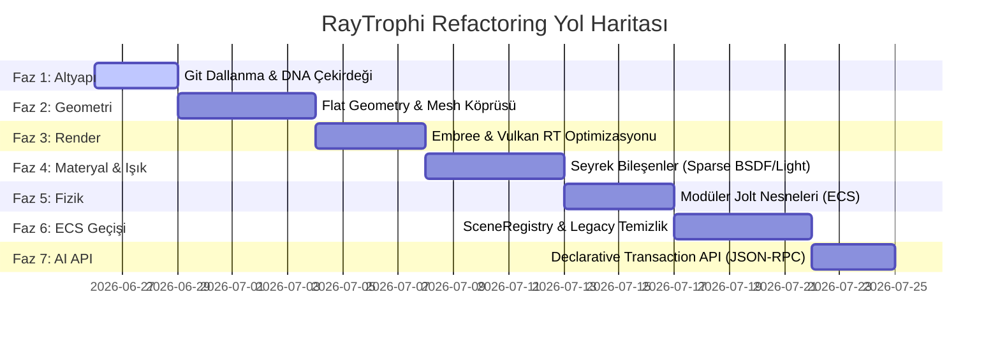
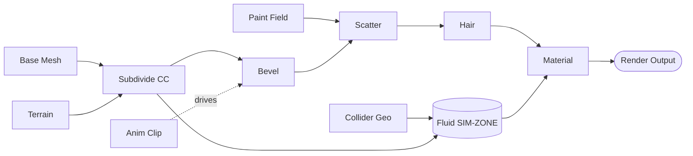

# RayTrophi Studio: Yeni Nesil Çekirdek DNA ve AI-Native Mimari Geçiş Planı

Bu belge, RayTrophi Studio'nun nesne yönelimli polimorfik yapısından; veri yönelimli (DoD/ECS), AVX256 uyumlu, sıfır gecikmeli flat mesh yapısına ve AI ajanlarının kontrol edebileceği durumsuz işlem (Transaction) API'sine geçiş sürecini adım adım detaylandırmaktadır. 

Bu plan, **sistemi bozmadan, her adımda derlenebilir ve test edilebilir (non-breaking)** bir kademeli geçiş yol haritası sunar.

---

## BÖLÜM 0: GÜNCEL İLERLEME DURUMU (son güncelleme 2026-06-28)

> Durum etiketleri: ✅ USER-CONFIRMED (build alındı + test edildi) · 🧪 untested (kod hazır, derlenir) · ⏳ planlandı · ⛔ ertelendi.
> Detaylı teknik kayıt: `.claude/.../memory/project_flat_proxy_migration_plan.md` ve `project_sculpt_on_flat_soa.md`.

### Faz 2–3: Flat Geometri + Render (büyük ölçüde TAMAM)
- ✅ DNA `GeometryDetail` flat SoA çekirdeği + `TriangleMesh` köprüsü + `AssimpLoader` flat yükleme.
- ✅ **Vulkan RT indexed BLAS** — solo BLAS 3N→indexed (VRAM tasarrufu).
- ✅ **Flat/proxy "materialize flip"** (`g_dense_mesh_as_hittable`): tek bir CC modifier'lı yoğun mesh, `world.objects`'te 12.6M ayrı `shared_ptr<Triangle>` facade yerine **tek `TriangleMesh`-as-Hittable** olarak tutuluyor. Ölçülen kazanç (12.6M üçgen, live-preview): render-hazır RSS **~7.7GB → ~2.8GB (~4.9GB↓)**, evaluate RSS +3395MB→+486MB, rebuildBVH 4027ms→832ms.
- ✅ Flat mesh tüketicileri bağlandı + doğrulandı: CPU (Embree) render, Vulkan RT render, Solid raster, **seçim + hiyerarşi** (tek temsilci facade ile, 136B), **materyal atama** (CPU+Vulkan, SoA toplu repaint + CPU BVH in-place remap), **viewport picking + taşıma** (Solid/CPU/Vulkan).
- ✅ Kritik bug fix'leri (hepsi doğrulandı): proje-açılış crash (standalone üçgen sayımı), CPU-BVH round-trip desync (build-time `getFinal()*P_orig`), Vulkan incremental move (TLAS node-index'e `TriangleMesh` dalı).

### Faz 2–3 KALAN (flat mesh'i uçtan-uca birinci sınıf yapmak)
- ⏳ **Sculpt-on-flat (SoA-native)** — *sıradaki iş*. Plan satır-çapalı hazır (`project_sculpt_on_flat_soa.md`): 9a build (vertices←SoA P_orig, facade weld yok) → 9b write-back (vertex↔SoA 1:1) → 9c normaller. Hedef: subdivide+sculpt'un asıl bellek/zaman maliyetini kaldırmak.
- ⏳ **apply-flat**: CC "Apply" (destructive bake) sonucu da facade yerine flat kalsın (sculpt-on-flat'e bağlı).
- ⏳ **open/import-flat** (gated): proje açılışı + import yoğun statik mesh'leri flat üretsin; **skinned/animasyonlu modeller** flat-skin desteği gelene kadar facade kalır.
- ⏳ **OptiX flat desteği** (ikincil backend; `collectRenderables` facade-coupled).
- ⛔ **Flat keyframe playback**: Vulkan per-frame TLAS transform flat mesh'te oynatma sırasında güncellenmiyor (durunca yakalıyor) — aynı sınıf bir eksik dal; yapı oturunca bakılacak.

### Faz 4–8 (henüz başlanmadı / vizyon)
- ⏳ Faz 4: Sparse Material/Light (MaterialExtension, Light `std::variant` — ışık ZATEN variant'a geçmiş, materyal kaldı).
- ⏳ Faz 5: Modüler Jolt ECS bileşenleri.
- ⏳ Faz 6: `SceneRegistry` ECS geçişi + legacy `Triangle`/facade tamamen kaldırma.
- ⏳ Faz 7: AI-Native Transaction API (JSON-RPC/WebSocket).
- ⏳ **Faz 8: Birleşik Node Grafiği** — geometri/terrain/water/scatter/hair/paint/fizik/particle/material/anim'i tek master node editörde tipli tellerle bağlamak. Omurga %60-70 hazır (NodeEditorUIV2, TerrainNodesV2, ModifierStack, SimCache, anim graph, SoA). Detay: aşağıda FAZ 8.

> Not: Flat geçişin stratejisi **heterojen `world.objects`** — küçük/skinned mesh'ler facade kalır, yalnızca yoğun statik mesh'ler `TriangleMesh`-as-Hittable olur. Migration **additive** (her tüketiciye flat dalı eklenir), rewrite değil; tüm flat davranışı `g_dense_mesh_as_hittable` arkasında (default OFF = sıfır davranış değişikliği, güvenle commit'lenebilir).

---

## BÖLÜM 1: Mimari Prensipler ve DNA Tanımı

Yeni mimarimizin temeli iki ana ilkeye dayanır:
1.  **Sanal Metotsuz Veri Blokları (POD Structs):** Geometri, Materyal, Işık ve Fizik verileri bellek üzerinde 32-byte hizalanmış, ardışık diziler halinde saklanır.
2.  **Sistem ve Veri Ayrımı:** Veri yapıları (`Component`) yalnızca ham veri taşır; mantıksal işlemler (`System`) bu verileri dışarıdan ve paralel olarak işler.

---

## BÖLÜM 2: 7 Aşamalı Uygulama Yol Haritası



---

### FAZ 1: Git Altyapısı ve DNA Çekirdeğinin Kurulması
**Amaç:** Mevcut `main` dalını koruyarak, izole ve güvenli bir geliştirme ortamı kurmak ve yeni veri modelinin (DNA) temel yapılarını tanımlamak.

1.  **Lokal Git Dalı Oluşturma:**
    ```bash
    git checkout main
    git pull origin main
    git checkout -b refactor/ultimate-scene-dna
    ```
2.  **DNA Dizini ve Aligned Allocator Kurulumu:**
    *   `source/include/DNA/` ve `source/src/DNA/` dizinleri oluşturulur.
    *   `source/include/DNA/AlignedAllocator.h` dosyası oluşturularak 32-byte bellek hizalama şablonu yazılır.
3.  **Temel Veri Modeli (`SceneRegistry`) Tanımı:**
    *   `source/include/DNA/SceneRegistry.h` içinde, sahnede yer alacak Entity (benzersiz kimlik) ve bu kimliklere bağlı bileşen (Component) tablolarının temel şeması kurulur.

---

### FAZ 2: Nitelik Tabanlı Geometri ve Mesh Köprüsü (Bridging)
**Amaç:** Polimorfik `Triangle` sınıfına dokunmadan, tüm mesh yükleme ve geometri yönetimini düzleştirilmiş (flat) ve paylaşımlı indeksli yapıya geçirmek.

1.  **`GeometryDetail` (Flat Mesh) Sınıfının Yazılması:**
    *   `source/include/DNA/GeometryDetail.h` içinde Houdini tarzı nitelik tabanlı veri yapısı tanımlanır. Pozisyonlar, normaller ve UV'ler 32-byte hizalanmış flat dizilerde saklanır.
2.  **Mevcut `TriangleMesh` Sınıfının Güncellenmesi (Köprüleme):**
    *   `TriangleMesh` sınıfının içi, verileri kendi içinde saklamak yerine, arka planda yeni `GeometryDetail` yapısını kullanacak şekilde revize edilir.
    *   `TriangleMesh` sınıfı `Hittable` kalmaya devam eder. Böylece **sahnede `std::shared_ptr<Hittable>` bekleyen hiçbir yer kırılmaz ve proje derlenmeye devam eder.**
3.  **Loader Güncellemesi:**
    *   `AssimpLoader.cpp` güncellenir; diskten okunan 3D modeller doğrudan `GeometryDetail` flat tamponlarına yüklenir.

---

### FAZ 3: Render Motoru ve GPU Transfer Optimizasyonu
**Amaç:** Vulkan RT, OptiX ve Embree sistemlerinin CPU üzerindeki polimorfik veri düzleştirme yükünü sıfırlamak; doğrudan bellek kopyalamaya (Zero-Copy GPU Upload) geçmek.

1.  **`EmbreeBVH::build` Güncellemesi:**
    *   `EmbreeBVH.cpp` içindeki `build` ve `updateGeometryFromTriangles` fonksiyonları revize edilir.
    *   Polimorfik üçgen döngüsü kaldırılarak, `GeometryDetail::positions` ve `indices` flat dizileri Embree vertex/index buffer'larına `memcpy` ile doğrudan ve paralel (OpenMP ile) kopyalanır.
2.  **Vulkan RT ve OptiX Arka Uç Güncellemeleri:**
    *   `OptixWrapper.cpp` ve Vulkan buffer yönetim kodları güncellenir. `GeometryDetail` ham işaretçileri directly GPU staging buffer'larına kopyalanarak ekran kartına gönderilir.
    *   CUDA kernel'ları (`gas_kernels.cu`) hiçbir değişikliğe uğramadan bu flat buffer'ları en yüksek hızda okumaya devam eder.

---

### FAZ 4: Seyrek Bileşenli Materyal ve Işık Yapısı
**Amaç:** Materyal ve Işık sınıflarını hantal inline özelliklerden arındırarak, yalnızca kullanılan parametreler için bellek tahsis eden (sparse/lazy payload) hale getirmek.

1.  **`Material` ve `MaterialExtension` Ayrımı:**
    *   `Material.h` içerisindeki 10 adet `MaterialProperty` inline alanı kaldırılır. Baz sınıf yalnızca temel renk ve pürüzlülük bilgilerini barındırır (~48 bayt).
    *   Gelişmiş özellikler (Resin/SSS, Dielectric/Cam, Clearcoat) için `MaterialExtension` türevleri (`ResinComponent` vb.) tanımlanır. Bu bileşenler yalnızca kullanıcı aktif ettiğinde `deep_ptr` ile dinamik olarak tahsis edilir.
2.  **`Light` Sınıfının `std::variant` ile Hafifletilmesi:**
    *   `Light.h` içerisindeki Point, Directional, Spot ve Area ışıklarının tüm değişkenleri tek sınıftan temizlenir.
    *   Işığa özel parametreler, C++ `std::variant` içinde tutularak yalnızca ilgili ışık aktifken bellekte yer kaplaması sağlanır.

---

## BÖLÜM 2: Yol Haritası Detayları (Güncellendi)

### FAZ 5: Modüler Jolt Fizik ve Simülasyon Bileşenleri
**Amaç:** `RigidBodyObject` yapısını ECS modeline uygun olarak bileşenlerine ayrıştırmak, statik/dinamik basit cisimlerin bellek tüketimini sıfırlamak.

1.  **`RigidBodyObject` Ayrıştırılması:**
    *   `RigidBodySystem.h` güncellenerek soft body, kumaş, akışkan etkileşimi (buoyancy/drag) ve kırılma parametreleri `RigidBodyObject` içinden çıkarılır.
    *   Bu parametreler `SoftBodyComponent`, `FluidCouplingComponent` ve `FractureComponent` olarak ayrı struct'lara taşınır ve ana nesneye `deep_ptr` ile bağlanır.
2.  **Fizik Çözücü Döngülerinin Optimizasyonu:**
    *   `RigidBodySystem.cpp` güncellenir; Jolt dünyası kurulurken yalnızca ilgili bileşene sahip olan nesneler özel simülasyon adımlarına (akışkan etkileşimi vb.) dahil edilir.

---

### FAZ 6: SceneRegistry ECS Geçişi ve Legacy Kod Temizliği
**Amaç:** Tüm sahne yönetimini (`SceneData::world`) `DNA::SceneRegistry` tabanlı Entity ve Flat Component tablolarına taşımak ve eski polimorfik `Triangle` yapısını tamamen temizlemek.

1.  **`SceneRegistry` Entegrasyonu:**
    *   `SceneData::world` yapısının, flat bileşen tablolarına ve `EntityID` tabanlı referanslara yönlendirilmesi.
2.  **Legacy Kodun Temizlenmesi:**
    *   Artık kullanılmayan eski `Triangle` sınıfı, `TriangleProxyConverter` ve ilişkili eski yardımcı kodlar projeden tamamen silinir.
3.  **Birim ve Görsel Testler (Validation):**
    *   Yeni flat geometri ve seyrek materyal yapısı ile alınan render çıktılarının, eski sistemle piksel piksel aynı olduğu doğrulanır.
    *   Büyük sahnelerde bellek ve yükleme süresi kazanımları profil araçlarıyla (Profiler) ölçülür.

---

### FAZ 7: AI-Native Durumsuz İşlem (Transaction) API'sinin Kurulması ve Yayına Alım
**Amaç:** Yapay zeka ajanlarının (LLM) uygulamayı dışarıdan, durumsuz ve güvenli bir port üzerinden kontrol etmesini sağlayacak altyapıyı kurmak ve refactoring dalını ana dala birleştirmek.

1.  **JSON-RPC / WebSocket Sunucusu Entegrasyonu:**
    *   Uygulama içine, GUI'den bağımsız çalışan, localhost portunu (örn: 8080) dinleyen hafif bir WebSocket/JSON-RPC sunucusu eklenir. Gelen istekler `SceneRegistry` üzerinden işletilir.
2.  **Declarative Transaction API Tasarımı:**
    *   AI ajanının göndereceği durumsuz "Transaction" (İşlem) paketlerini işleyen sistem yazılır. AI ajanı sahne durumunu JSON yamalarıyla günceller.
3.  **Anlamsal Katman (`SemanticComponent`) Tanımı:**
    *   Nesnelere doğal dil açıklamaları ("a wooden table leg"), etiketler ve hiyerarşik ilişkiler atayan bileşen sisteme eklenir. AI ajanının sahneye doğal dilde uzamsal sorgular atabilmesi sağlanır.
4.  **Git Merge:**
    *   Refactoring dalı ana dala birleştirilir:
      ```bash
      git checkout main
      git merge refactor/ultimate-scene-dna
      git push origin main
      ```

---

## FAZ 8: Birleşik Node Grafiği (Unified Node Graph) — "Her Şey Bir Node"

**Amaç:** Tüm sahne üretimini — geometri, terrain, water, scatter, hair, paint, fizik (fluid/gas/rigid/soft/cloth), particle, material ve animasyon — **tek bir master node editöründe** birbirine bağlanabilen, **tipli teller**le veri akıtan, **non-destructive** ve **lazy/cache'li** değerlendirilen bir grafiğe taşımak. Hedef: yeni bir efekt/operatör eklemek = **yeni bir node sınıfı yazmak** (çekirdeğe dokunmadan). Houdini SOP/DOP + Blender Geometry Nodes ruhunda, ama RayTrophi'nin SoA DNA'sı üstünde.

### 8.0 Mevcut Hazır Parçalar (omurga zaten %60-70 kurulu)
- ✅ **Node editör UI altyapısı**: `NodeEditorUIV2` + `NodeSystem/Node.h` (node base, socket, bağlantı, çizim).
- ✅ **Referans node grafiği**: `TerrainNodesV2` (terrain zaten node-tabanlı üretiliyor).
- ✅ **Linear geo-graph prototipi**: `ModifierStack::evaluate` (CC subdivide vb. SoA üretir) + generation-based cache invalidation (`g_scene_geometry_generation`).
- ✅ **Animasyon graph'i**: keyframe graph editörü + interpolasyon + `Animator`/clip sistemi (zaman-bağımlı node'ların temeli).
- ✅ **Simülasyon cache backing**: `SimCache` + frame_cache + sim serialize (sim-zone'ların zaman-adımlı çıktısını saklama altyapısı).
- ✅ **Domain alt-sistemleri**: water, scatter, hair, particle, fluid/gas, Jolt rigid/soft/cloth, paint, material (+ `GpuMaterial` flat GPU mirror).
- ✅ **SoA çekirdek**: `GeometryDetail` (P/N/uv/indices/materialID + keyfi attribute) — tellerde akacak ortak veri tipi.

> **Eksik olan tek şey:** bu siloları birleştiren **ortak veri kontratı (tipli socket)** + **tek değerlendirme motoru** + zaman/sim bağımlılık modeli. Bu "yeni özellik" değil, var olanları tek kontrata bağlamaktır.

### 8.1 Veri Modeli — Tipli Socket'ler ("tellerde ne akar")
Her bağlantı tipli bir veri taşır. Çekirdek socket tipleri:

| Socket | Taşıdığı veri | Mevcut karşılığı |
|---|---|---|
| **Geometry** | SoA `GeometryDetail` (P/N/uv/indices/attrs) | base mesh, terrain, CC çıktısı |
| **Field** | per-element attribute (mask, density, group, weight, color) | sculpt mask, vertex group, paint layer |
| **Instances** | nokta + transform + (opsiyonel) referans geometri | scatter, hair kökleri |
| **Volume** | VDB / yoğunluk grid'i | fluid/gas domain |
| **Simulation** | stateful, zaman-adımlı handle (cache-backed) | Jolt body, fluid/gas/particle sim |
| **Material** | shader alt-grafiği handle'ı | PrincipledBSDF + GpuMaterial |
| **Light** | ışık parametreleri (variant) | Point/Spot/Area/Directional |

```cpp
// Tellerde akan birleşik paket (sahiplik COW ile paylaşımlı)
struct NodeData {
    SocketType type;
    std::shared_ptr<DNA::GeometryDetail> geometry;   // Geometry / Field (attr ekli)
    std::shared_ptr<InstanceSet>        instances;   // Instances
    std::shared_ptr<VolumeGrid>         volume;      // Volume
    SimHandle                           sim;         // Simulation (cache-backed)
    MaterialGraphRef                    material;     // Material
    // Field'lar GeometryDetail içindeki named attribute'larda taşınır (ayrı buffer gerekmez)
};
```
**Anahtar:** Field'lar ayrı bir yapı değil — `GeometryDetail`'in **named attribute** dizileri. "mask", "density", "Cd" (color) gibi. Bu, attribute-driven (Houdini tarzı) modelin tüm gücünü bedavaya verir + COW ile değişmeyen attribute paylaşılır.

### 8.2 Node Arayüzü — ortak kontrat (genişletilebilirliğin kalbi)
```cpp
class GeometryNode {                       // tüm node'ların tabanı
public:
    virtual std::string typeName() const = 0;
    virtual std::vector<SocketDecl> inputs()  const = 0;   // tip + isim
    virtual std::vector<SocketDecl> outputs() const = 0;
    virtual void drawParams() = 0;                          // ImGui parametre UI
    virtual NodeData evaluate(std::span<const NodeData> in,
                              const EvalContext& ctx) = 0;   // SAF fonksiyon (geo node'lar)
    virtual uint64_t hashParams() const = 0;                // cache invalidation için
};
```
**Yeni node eklemek = bu arayüzü implemente etmek + registry'ye kaydetmek. Üç adım, çekirdeğe dokunmadan.**

Simülasyon node'ları özel bir alt-arayüz kullanır (zaman-bağımlı):
```cpp
class SimulationNode : public GeometryNode {
    virtual void step(const EvalContext& ctx, float dt) = 0;  // frame ilerlet
    virtual NodeData readFrame(int frame) = 0;                 // cache'ten oku (SimCache)
};
```

### 8.3 Node Taksonomisi (mevcut sistemler → node'lar)
- **Input/Source:** Base Mesh · Terrain · Primitive · Import · Curve
- **Geometry (fonksiyonel):** Subdivide(CC) · Bevel · Inset · Extrude · Mirror · Array · Boolean · Transform · Remesh · **Sculpt Layer** (delta'yı attribute olarak saklar = non-destructive)
- **Attribute/Field:** Paint · Vertex Group · Mask · Noise · Math · Attribute Transfer · Color
- **Instancing:** Scatter · Hair · Instance-on-Points
- **Simulation (sim-zone, cache-backed):** Fluid · Gas · Rigid Body (Jolt) · Soft/Cloth · Particle · Collider
- **Volume:** VDB Import · Volume Sample · Volume→Mesh (isosurface)
- **Shading:** Material (PrincipledBSDF) · Texture · Shader Math → **ayrı shader DAG**
- **Animation:** Anim Clip · Keyframe Curve · Drive-by-Attribute (zaman → parametre/transform)
- **Output:** Render Output (geo+material+light → backend)

### 8.4 Değerlendirme Motoru + Sim-Zone Ayrımı

- **Fonksiyonel DAG:** topolojik sıralama + her node `hashParams()`+girdi-hash'i ile cache'lenir → sadece değişen alt-ağaç yeniden hesaplanır (COW attribute paylaşımı).
- **Sim-Zone (özel):** stateful + zaman-adımlı; `step()` ile frame frame ilerler, çıktı `SimCache`'e yazılır; downstream node'lar `readFrame()` ile okur. Geo node gibi "anında re-eval" edilmez — **zaman ekseni** ayrı bağımlılıktır.
- **Animation:** zaman → node parametresi/transform sürücüsü (anim graph mevcut keyframe motorunu besler).

### 8.5 Genişletilebilirlik & Görsel Temsil İlkeleri
- **Yeni node = tek sınıf + registry kaydı.** Çekirdek motor değişmez.
- **Tipli renkli teller:** her socket tipi sabit renk (Geometry yeşil, Field mavi, Volume mor, Sim turuncu, Material sarı…) → grafik bir bakışta okunur.
- **Canlı önizleme:** her node çıktısı viewport'ta gösterilebilir (debug "spy" düğümü).
- **Group/Subnet:** node grupları katlanabilir (karmaşık ağları sadeleştirir) — `NodeEditorUIV2` group desteği var.

### 8.6 Sıralama (her adım derlenir + test edilir)
1. **8a — Geo-DAG:** `ModifierStack` (linear) → tipli Geometry socket'li DAG. En olgun, tek-domain parça.
2. **8b — Field + Instances:** named-attribute Field modeli → Paint/Mask/Scatter/Hair node'ları (hepsi fonksiyonel, sim değil = kolay).
3. **8c — Sim-Zone:** Volume + Simulation socket → Fluid/Gas/Jolt/Particle'ı cache-backed sim-zone olarak bağla.
4. **8d — Material/Shading DAG:** GpuMaterial mirror üzerine shader graph; geo çıktısına iliştir.
5. **8e — Master Editör:** hepsini `NodeEditorUIV2` altında tek editörde topla + Animation sürücüleri.

> **Önkoşul:** Faz 2-3 (flat geometri) + sculpt-on-flat tamamlanmış olmalı — base mesh + modifier ikisi de SoA olunca geo-DAG doğal kurulur. Terrain node'u (TerrainNodesV2) bu omurganın ilk taşıdır; master editör onu **genelleştirmek** olacak, sıfırdan değil.

---

## BÖLÜM 3: Riskler ve Güvenlik Önlemleri

*   **Derleme Hataları:** Her aşamada proje derlenmeli ve test edilmelidir. Kod hiçbir zaman "çalışmayan, derlenemeyen" bir durumda uzun süre bırakılmamalıdır.
*   **CUDA Sürüm Sınırları:** C++20 standardı kesinlikle korunmalı, CUDA uyumsuzluğu yaratacak C++23 deneysel özelliklerinden kaçınılmalıdır.
*   **Port Güvenliği:** WebSocket portu üzerinden gelen tüm JSON paketleri katı şema doğrulamasından (schema validation) geçirilmeli, işletim sistemine yetkisiz erişimler engellenmelidir.
