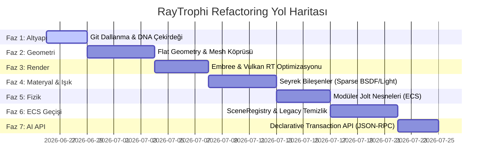

# RayTrophi Studio: Yeni Nesil Çekirdek DNA ve AI-Native Mimari Geçiş Planı

Bu belge, RayTrophi Studio'nun nesne yönelimli polimorfik yapısından; veri yönelimli (DoD/ECS), AVX256 uyumlu, sıfır gecikmeli flat mesh yapısına ve AI ajanlarının kontrol edebileceği durumsuz işlem (Transaction) API'sine geçiş sürecini adım adım detaylandırmaktadır. 

Bu plan, **sistemi bozmadan, her adımda derlenebilir ve test edilebilir (non-breaking)** bir kademeli geçiş yol haritası sunar.

---

## BÖLÜM 0: GÜNCEL İLERLEME DURUMU (son güncelleme 2026-06-28)

> Durum etiketleri: ✅ USER-CONFIRMED (build alındı + test edildi) · 🧪 untested (kod hazır, derlenir) · ⏳ planlandı · ⛔ ertelendi.
> Detaylı teknik kayıt: `.claude/.../memory/project_flat_proxy_migration_plan.md` ve `project_sculpt_on_flat_soa.md`.

### Faz 2–3: Flat Geometri + Render (büyük ölçüde TAMAM)
- ✅ DNA `GeometryDetail` flat SoA çekirdeği + `TriangleMesh` köprüsü + `AssimpLoader` flat yükleme.
- ✅ **Vulkan RT indexed BLAS** — solo BLAS 3N→indexed (VRAM tasarrufu).
- ✅ **Flat/proxy "materialize flip"** (`g_dense_mesh_as_hittable`): tek bir CC modifier'lı yoğun mesh, `world.objects`'te 12.6M ayrı `shared_ptr<Triangle>` facade yerine **tek `TriangleMesh`-as-Hittable** olarak tutuluyor. Ölçülen kazanç (12.6M üçgen, live-preview): render-hazır RSS **~7.7GB → ~2.8GB (~4.9GB↓)**, evaluate RSS +3395MB→+486MB, rebuildBVH 4027ms→832ms.
- ✅ Flat mesh tüketicileri bağlandı + doğrulandı: CPU (Embree) render, Vulkan RT render, Solid raster, **seçim + hiyerarşi** (tek temsilci facade ile, 136B), **materyal atama** (CPU+Vulkan, SoA toplu repaint + CPU BVH in-place remap), **viewport picking + taşıma** (Solid/CPU/Vulkan).
- ✅ Kritik bug fix'leri (hepsi doğrulandı): proje-açılış crash (standalone üçgen sayımı), CPU-BVH round-trip desync (build-time `getFinal()*P_orig`), Vulkan incremental move (TLAS node-index'e `TriangleMesh` dalı).

### Faz 2–3 KALAN (flat mesh'i uçtan-uca birinci sınıf yapmak)
- ✅ **Sculpt-on-flat (SoA-native)** — USER-CONFIRMED tamam.
- ⏳ **Skinned/animasyonlu modeller** — hâlâ facade; flat mesh geçişinde kalan TEK büyük boşluk bu (Terrain/Water/River/sculpt/scatter hepsi flat'e geçti; imported multi-material statik mesh'ler de flat).
- ⏳ **OptiX flat desteği** (ikincil backend; `collectRenderables` facade-coupled).
- ⛔ **Flat keyframe playback**: Vulkan per-frame TLAS transform flat mesh'te oynatma sırasında güncellenmiyor (durunca yakalıyor) — aynı sınıf bir eksik dal; yapı oturunca bakılacak.

### Faz 4–8 (henüz başlanmadı / vizyon)
- ⏳ Faz 4: Sparse Material/Light (MaterialExtension, Light `std::variant` — ışık ZATEN variant'a geçmiş, materyal kaldı).
- ✅ Faz 5: Modüler Jolt bileşenleri — USER-CONFIRMED tamam (soft body/cloth/fluid-coupling/fracture ayrıştırıldı).
- ⏳ Faz 6: `SceneRegistry` ECS geçişi + legacy `Triangle`/facade tamamen kaldırma.
- ⏳ Faz 7: AI-Native Transaction API (JSON-RPC/WebSocket).
- ⏳ **Faz 8: Birleşik Node Grafiği** — geometri/terrain/water/scatter/hair/paint/fizik/particle/material/anim'i tek master node editörde tipli tellerle bağlamak. Omurga %60-70 hazır (NodeEditorUIV2, TerrainNodesV2, ModifierStack, SimCache, anim graph, SoA). Detay: aşağıda FAZ 8.
  - 🧪 **NodeRegistry eklendi** (`NodeSystem/NodeRegistry.h`, 2026-07-02): domain-agnostic `typeId -> factory` self-registration (`AutoRegisterNode<T>`), Meyer's singleton. TerrainNodesV2'nin 36 node tipi kendi `getTypeId()` string'iyle kayıtlı (`TerrainNodesV2.cpp`, `addTerrainNode`'un switch'i DOKUNULMADI — registry ek/paralel bir yol). Faz 8'in "her domain kendi enum switch'ini merkezi editöre sızdırmadan node oluşturabilmeli" ihtiyacını çözüyor. USER-CONFIRMED derleniyor; henüz hiçbir call site `create()`/`getAllTypes()` kullanmıyor (sadece static-init kaydı canlı).
  - 🧪 **Faz 8a başladı — Geo-DAG ilk dilim** (`GeometryNodesV2.h`, 2026-07-02, USER-CONFIRMED derleniyor):
    - `PinValue`'ya `GeometryValue = std::shared_ptr<TriangleMesh>` eklendi (`NodeCore.h`) — Geometry socket artık gerçek veri taşıyor (önceden `DataType::Geometry` enum'da vardı ama `PinValue` variant'ında YOKTU, mimari-inceleme ajanının bulduğu tek gerçek boşluktu). `TriangleMesh` forward-declare edilerek NodeCore.h'a domain include'u sızdırılmadı.
    - `GeometryContext`/`GeometryNodeBase` — TerrainContext/TerrainNodeBase'in aynısı, geometri için.
    - `BaseMeshNode` (kaynak, zero-copy passthrough) + `SubdivideCCNode` (mevcut `MeshModifiers::catmullClarkSubDStencil`'i sarmalıyor — algoritma TEKRAR YAZILMADI, ModifierStack'in canlı CC modifier'ının kullandığı AYNI fonksiyon çağrılıyor). Girdi tarafında facade materialize ediliyor (cage için gerekli), çıktı tarafı zaten flat/zero-copy (`outMesh` parametresi).
    - Kayıt: `NodeRegistry`'ye `GeoV2.BaseMesh`/`GeoV2.SubdivideCC` olarak self-register (`MeshModifiers.cpp`'ye eklendi — yeni .cpp AÇILMADI, vcxproj'a dokunulmadı, header'lar zaten .vcxproj'da listelenmeden derleniyor, NodeRegistry.h de öyle derlendi).
    - Mevcut `ModifierStack` UI/panel'e HİÇ dokunulmadı — tamamen ek/paralel; hâlâ eskisi gibi çalışıyor.
    - **USER-CONFIRMED (2026-07-02, aynı gün): UI'a bağlandı ve uçtan uca çalışıyor** — panel (alt-dock tab), toolbar (Add Node/Evaluate), sağ-klik ekle/sil (node için `NodeEditorUIV2`'nin kendi `LocalNodeContextPopup`'ı canlandırıldı — daha önce hiç açılmıyordu, core'da düzeltildi; boş canvas için `onDrawBackgroundMenu` hook'u kullanıldı), sağ panelde node parametreleri. Yol boyunca bulunup düzeltilen ciddi buglar: (1) çift Base Mesh → yanlış terminal seçimi, (2) 6 ayrı yerde hardcoded panel-adı listesi eksikti (panel bazen hiç açılmıyordu — asıl kök neden `drawStatusAndBottom`'daki erken `return`), (3) Delete tuşunu dinleyen 3 BAĞIMSIZ global listener vardı (hepsi `geometry_graph_focused` ile kapılandı), (4) `graph.evaluate()` bağlı-olmayan dalları da eager hesaplıyordu (kaldırıldı, saf pull-based), (5) her Evaluate bir öncekinin ÜZERİNE yazıyordu (kök neden: base mesh her seferinde sahnenin GÜNCEL/zaten-evaluate-edilmiş halinden okunuyordu — `originalBaseMesh` snapshot ile çözüldü), (6) Translate node `P` (türetilmiş/aktif pozisyon) yerine `P_orig`'e yazmalıydı — flat mesh'lerde `P` her zaman `P_orig`+`transform`'dan yeniden türetiliyor, düz `P` yazımı bir sonraki rebake'de siliniyordu.
    - Eklenen node tipleri: `BaseMesh`, `Subdivide` (Flat/Catmull-Clark modu, ModifierStack ile parametre eşleşiyor), `Transform` (Translate+Rotate+Scale birleşik — artık objenin PIVOT'unu (`Transform::position/rotation/scale`) hareket ettiriyor, gizmo ile obje taşımayla aynı semantik; `P_orig` dokunulmuyor, yalnızca aktif `P`/`N` yeni transform'dan `rebakeMesh` pattern'iyle yeniden türetiliyor), `Output` (tek zorunlu sink — paralel dallardaki "hangisi kazanıyor" belirsizliğini çözmek için eklendi, kullanıcının kendi önerisiyle).
    - **USER-CONFIRMED (2026-07-02, aynı gün, devam): grup sistemi (yeniden adlandırma/renk/silme) + node sağ-klik Delete tam çalışıyor** (kök neden: `OpenPopup()`/`BeginPopup()` farklı ImGui ID-stack derinliklerinde çağrılıyordu — node/grup'un kendi `PushID` kapsamı içinde `OpenPopup`, ama `drawPopups()`'taki `BeginPopup` kök seviyede; `OpenPopup` çağrısını ilgili `PopID()`'den hemen sonraya erteleyen `nodeContextMenuRequested_`/`groupContextMenuRequested_` bayraklarıyla düzeltildi, paylaşılan `NodeEditorUIV2.h`'de → Terrain Graph da kazandı). **Transform node sonrası gizmo eski konumda kalma bug'ı da çözüldü**: kök neden TransformNode'un ofseti `P_orig`'e gömüp `Transform::position`'a hiç dokunmaması, ama `SceneSelection::updatePositionFromSelection()`'ın gizmo pozisyonunu her zaman `transform->getPivotMatrix()`'den türetmesiydi — TransformNode artık gerçek pivot'u taşıyor (+ `Transform::updateMatrix()` çağrısı, `position/rotation/scale` alanları `updateMatrix()` çağrılmadan `base` matrisine yansımıyor).
    - 🧪 **Faz 8a genişleme — 4 yeni node** (2026-07-03, untested/derlenmedi): `Mirror` (lokal eksen yansıtma + winding flip, opsiyonel merge-with-original — Blender Mirror modifier davranışı), `NoiseDisplace` (normal boyunca FBM displacement — `Physics::Noise::fbm3D`/CurlNoise yeniden kullanıldı, force field'ların örneklediği AYNI host noise; sonrasında alan-ağırlıklı normal recompute + rebake), `Merge (Join)` (iki Geometry girişi tek mesh'te — B, `inv(A.final)*B.final` relative matrisiyle A'nın pivot uzayına taşınır; per-vertex materialID'ler KORUNUR = multi-material sonuç doğru render olur), `ObjectSource` (sahnedeki başka bir flat objeyi isimle grafiğe kaynak verir — `GeometryContext::resolveObjectMesh` callback'i `evaluateGeometryGraph`'ta `direct_mesh_nodes`'tan bağlanır; grafiğin KENDİ objesi istenirse compounding'i önlemek için pristine `originalBaseMesh` döner). Ortak yardımcılar: `deepCopyMesh`/`rebakeFromOrig`/`recomputeOrigNormals`/`appendMeshInto` (hepsi `GeometryNodesV2.h` içinde, saf — girdi mutate edilmez). UI: toolbar combo + sağ-klik canvas menüsü + registry kayıtları (`MeshModifiers.cpp`) güncellendi.
    - 🧪 **Faz 8a devam** (2026-07-03, untested): (1) NoiseDisplace'e 8-tip noise combo (FBM/Perlin/Simplex/Turbulence/Ridge/Billow/Voronoi/Crackle — hepsi mevcut `Physics::Noise`) + Midlevel; (2) `Weld (Merge by Distance)` node (Merge'e otomatik kaynak KOYULMADI — Blender'ın Join/Merge-by-Distance ayrımı bilinçli korundu); (3) ObjectSource isim kutusu → sahne-objesi picker combo (`g_sceneObjectListProvider`, liste yalnız combo açıkken çekilir = sıfır per-frame maliyet, polling yok); (4) **Apply butonu** (Blender modifier-Apply semantiği: evaluate + sonucu yeni `originalBaseMesh` yap + `graph.clear()` — sculpt/edit öncesi "bitir" sınırı); (5) **seam yırtılma fixi**: flat-subdivide/UV-seam kaynaklı çakışık-ayrık vertexler farklı normallerle farklı yönlere itiliyordu — `buildCoincidentRemap` (bit-identical pozisyon kümeleme) ile displacement yönü küme-ortalamalı normalden + `recomputeOrigNormals` weld-aware yapıldı (CC etkilenmiyordu çünkü çıktısı zaten kaynaklı).
    - 🧪 **Faz 8a graf serialization** (2026-07-03, untested): node param `serializeParams/deserializeParams` virtualleri (`GeometryNodeBase`'te, core NodeBase'e DOKUNULMADI) + `serializeGeometryGraph/deserializeGeometryGraph` (GeometryNodesV2.h). Node'lar typeId ile kaydedilir, load'da `NodeRegistry::create()` ile yaratılır — **registry'nin ilk gerçek call site'ı**. Link'ler (nodeId + pin INDEX) çifti olarak saklanır (pin id'leri load'da yeniden atanır). Gruplar dahil. **`originalBaseMesh` binary sidecar'a yazılır** (PaintLayerStack offset+size deseni) — yoksa load sonrası ilk Evaluate, kayıtlı (zaten evaluate edilmiş) mesh'i snapshot alıp compound ederdi. Call site'lar: ProjectManager save/load (binary'li) + SceneSerializer save/load (bin=nullptr, yalnız yapı). Load'da auto-evaluate YOK (kayıtlı mesh zaten sonuç). Eski projeler etkilenmez (`geometry_node_graphs` anahtarı yoksa sessizce geçilir).
    - 🧪 **Faz 8b BAŞLADI — Field ilk dilim** (2026-07-03, untested): plan 8.1'in kararı uygulandı — **Field = GeometryDetail named attribute (per-vertex float), ayrı socket tipi YOK**, attribute Geometry teliyle akar (Houdini modeli). Üreticiler: `MaskByHeight` (lokal Y smoothstep, Relative bbox modu default) + `MaskBySlope` (N_orig vs +Y açısı, derece ramp) — mavi Field header. Tüketici: `NoiseDisplace.UseMask` (+attribute adı) — mask **küme-ortalamalı** uygulanır (slope mask seam duplicate'lerinde farklı çıkar; per-duplicate büyüklük seam yırtığını yeniden açardı). `ensureFloatAttribute` helper. Not: custom attribute'lar deep-copy/Transform'dan geçer ama SubdivideCC (facade yolu) ve Weld'den GEÇMEZ — mask node'ları zincirde Subdivide'dan SONRA konmalı. Sculpt mask'ı ayrı UI-buffer'da (`SculptMaskState`), attribute değil — "Mask to Attribute" köprüsü sonraki adım. Serialize dahil (params + registry).
    - 🧪 **Faz 8b Scatter-as-Instances** (2026-07-03, untested): `ScatterInstances` node — yüzeyde alan-ağırlıklı deterministik örnekleme (world-space CDF + sqrt-trick barycentric, mt19937(seed)), **mask = yoğunluk** (rejection sampling — MaskByHeight/Slope/Noise'un asıl müşterisi). Mevcut foliage/InstanceManager boru hattına köprü: modern multi-source `ScatterSource` kontratı (ParticleRenderBridge ile aynı), `generateRandomTransform` yeniden kullanımı, **stable groupName** (bir kez üretilir + serialize edilir → re-Evaluate grubu ÇOĞALTMAZ, değiştirir). Node geometri açısından saf pass-through; instance yan etkisi `GeometryContext::instancesDirty` üzerinden `evaluateGeometryGraph`'ta `rebuildSceneObjects` ile, BVH/backend rebuild'lerinden ÖNCE uygulanır. compute() MeshModifiers.cpp'de (header'a InstanceManager sokulmadı). Eksikler: min-distance/poisson yok (kümelenebilir), node silinince grup yetim kalır (foliage UI'dan silinir).
    - 🧪 **Faz 8b — sculpt-mask köprüsü + min-distance + Mask Remap/Math + scatter-stack mask** (2026-07-03, untested): (1) sculpt mask ↔ Field attribute köprüsü — `PositionValueLookup` (pozisyon-eşleşmeli, `EditableMeshCache.local_position` ile flat mesh `P_orig` AYNI uzayda olduğu doğrulandı, `refs` yürümeye gerek kalmadı), Mask panelinde Export/Import butonları; (2) `ScatterInstancesNode`'a Min Distance (Weld'in spatial-hash deseni); (3) `MaskRemap` (gamma+contrast+invert) ve `MaskMath` (add/mul/min/max/subtract/average, iki mask birleştirme) node'ları; (4) scatter STACK (fırça) da artık mask attribute okuyor — `InstanceGroup::BrushSettings::mask_attribute`/`mask_scale_influence`, `paintInstances`'ta barycentric örnekleme ile gate+scale, Scatter Brush panelinde UI. Hepsi kaydediliyor (3 InstanceManager serialize yolu da güncellendi).
    - 🧪 **Faz 8b — density/scale mask ayrı slot + attribute dropdown** (2026-07-03, untested, kullanıcı sorusu: "Blender weight verisi gibi yoğunluk ayrı scale ayrı kullanılamaz mı"): tek `mask_attribute` alanının hem yoğunluk hem scale'i sürüklediği yer (ScatterInstancesNode + Scatter Brush `BrushSettings`) iki bağımsız isimli role bölündü — `density_mask_attribute` (yerleşimi kapatır) ve `scale_mask_attribute`+influence (bağımsız, farklı bir attribute'a bakabilir — ör. yoğunluk boyalı maskeden, boyut ayrı bir "kenara uzaklık" attribute'undan). Eski tek-alan kayıtlar geri-uyumlu okunuyor (yeni anahtar → eski anahtar → default zinciri, 3 InstanceManager serialize yolu da). Yeni: `DNA::GeometryDetail::listCustomAttributeNames()` — sadece Scatter Brush panelinde (hedef mesh zaten biliniyor, ucuz) serbest-metin yerine DROPDOWN'a bağlandı, typo riski yok. Geo-DAG node property panelleri (ScatterInstancesNode dahil) bilinçli olarak serbest-metin bırakıldı — node çizim anında hangi mesh'in bu pin'i beslediği graph evaluate edilmeden bilinmiyor, bazı alanları dropdown bazılarını text bırakmak asıl kafa karıştırıcı olurdu.
    - 🧪 **Faz 8b — Scatter Panel'e mask-aware procedural Fill** (2026-07-04, untested, kullanıcı bugu: "dropdown'da mask seçiliyor ama scatter terrain değilse sadece fırça ile yapılıyor, sistem maskı dikkate almıyor"): kök neden — genel Scatter panelinden (`scene_ui_scatter.cpp`) ulaşılan tek mesh-hedef yolu fırça boyamaydı; Target-Count'lu prosedürel "Scatter" dolgu butonu SADECE Terrain panelinde (`scene_ui_terrain.hpp`) yaşıyordu ve Field density/scale mask'larını hiç örneklemiyordu (Round 8'den önce yazılmış, güncellenmemiş). Tek noktadan çözüm: `MeshSurfaceSampler::Sample` artık kazanan üçgeni + barycentric ağırlıkları taşıyor, yeni `InstanceGroup::scatterFillMesh()` (Placement Rules + min-distance + Field density/scale mask + generateRandomTransform) tek implementasyon oldu, terrain.hpp'nin eski 65 satırlık kopyası artık ona delege ediyor. Scatter panele "Scatter (Fill)" başlığı altında Target Count/Seed/Min Distance + "Scatter Fill (Replace)" butonu eklendi — Geo-DAG ScatterInstancesNode ile AYNI mask-farkında CDF yerleşimi artık obje-scatter panelinden de erişilebilir. Yan bulgu: `height_min/max` (varsayılan -10/10, terrain-altitude ölçekli) bu panelde hiç UI'da yoktu — mesh hedefler için sessizce 0 instance üretirdi; "Max Slope" yanına "Height Range" eklendi (±100000 aralık, obje-uzayı için).
    - 🧪 **Faz 8a — Array node** (2026-07-04, untested): Blender Array modifier (Object Offset stili) — `Count` kopya, her biri bir öncekinin üstüne AYNI per-step translate/rotate/scale matrisi bindirilerek (compounding) yerleştirilir, böylece rotasyon sıfır değilken kopyalar pivot etrafında spiral yapar (düz per-adım `offset*i` bunu veremez). Yeni algoritma yazılmadı — Merge node'un `appendMeshInto` relPoint/relNormal mekanizması, ikinci bir geometri akışı yerine AYNI orijinal girdiye karşı count-1 kez çağrılarak reuse edildi. Toolbar combo + sağ-klik canvas menüsü + registry kaydı (`MeshModifiers.cpp`) eklendi.
    - 🧪 **Faz 8a — flat SoA ↔ half-edge köprüsü + Extrude/Inset node'ları** (2026-07-04, untested): flat TriangleMesh'in facade Edit Mode'daki gibi bir half-edge topolojisi YOKTU (`MeshEdit::HalfEdgeMesh` sadece `EditableMeshCache` üzerinden facade objelere bağlıydı). Yeni `buildHalfEdgeFromFlatMesh`/`rebuildFlatMeshFromHalfEdge` (`GeometryNodesV2.h`) köprüsü: flat soup'u `buildCoincidentRemap` (bit-identical pozisyon kümeleme, NoiseDisplace'in seam-fix'iyle AYNI yardımcı) ile weld edip `MeshEdit::HalfEdgeMesh::buildFromPolygons`'a veriyor (degenerate üçgenler ÖNCEDEN elenip face-id hizası korunuyor — `buildFromPolygons`'un kendi skip sayacı naif bir index eşlemesini bozardı), sonuçta `extrudeFace`/`insetFace` (facade Edit Mode'un Inset/Extrude'unun KULLANDIĞI AYNI Euler operatörleri, yeni algoritma yok) her yüze tek tek uygulanıyor, sonra Triangle facade + `MeshModifiers::facadesToFlatMesh` (SubdivideCC'nin Flat modunun kullandığı AYNI dönüşüm) ile flat mesh'e geri fan-triangulate ediliyor. Yeni `ExtrudeNode`/`InsetNode`: her ikisi de Blender'ın "Individual Faces" semantiği (Region değil — komşu yüzeyler eski ortak kenarda ayrılır), materialID kaynak üçgenden (`faceSourceMap` ile orijinal face'e geri izlenerek) miras alınıyor, yeni yüzeyler düz-shaded normal + planar UV (`buildFacePlanarUVs`, facade koddaki `buildPolygonPlanarUVs` ile aynı formül) alıyor. Toolbar combo + sağ-klik canvas menüsü + registry kaydı eklendi. Bilinen sınır: whole-mesh (seçim/mask-gate yok — sıradaki round'a bırakıldı), Inset'te Blender'ın Depth parametresi yok (`insetFace` API'si sadece t/Amount destekliyor).
    - 🧪 **Faz 8a — Extrude/Inset quad-detect fixi** (2026-07-04, untested, kullanıcı bugu: "insetnode yüzeyin quad yapısı yerine triangle yapısını kullanıp triangle inset ediyor, edit modda inset quad ekleme yapıyordu"): kök neden — `buildHalfEdgeFromFlatMesh` flat soup'taki HER üçgeni ayrı bir half-edge face yapıyordu (facade Edit Mode'un `EditableMeshCache.polygon_faces`'tan gelen gerçek quad kaydı flat SoA'da hiç YOK, kaybolmuş). Yeni `mergeCoplanarTrianglePairs` (`GeometryNodesV2.h`): triangülasyonun eklediği diagonal kenarı geri bulup `dissolveEdge` (var olan Euler op, yeni algoritma değil) ile üçgen çiftini quad'a birleştiriyor — PAIRWISE only (her üçgen en fazla BİR komşuyla birleşir, zincirlenmez), yoksa tamamen düz/coplanar bir yüzey (ör. bölünmüş bir zemin) tüm quad'ları TEK dev yüzeye kaynaştırırdı. `ExtrudeNode`/`InsetNode`'a `mergeQuads` (default true, "Detect Quads" checkbox) parametresi eklendi — orijinal face-id'ler merge sonrası sabit kaldığı için `faceToTriangle`/materialID eşlemesi bozulmuyor.
    - 🧪 **Faz 8a — Extrude/Inset mask-gate + BEVEL (node + stack modifier)** (2026-07-04, untested):
      - **Mask-gate**: Extrude/Inset artık Field mask okuyor (kullanıcı isteği: "edit nodelar objenin tüm facelerine uyguluyor"): `FlatHalfEdgeBridge.sourceToWelded` (source vertex → welded he-vertex) + `buildWeldedVertexMask` (küme-ortalamalı, NoiseDisplace kuralı) + `faceMaskAverage` (per-face ortalama, quad-merge sonrası da geçerli — dissolveEdge vertex id'leri korur). UI: Use Mask + Mask Attr + Threshold (0.5) + "Mask Scales Distance/Amount"; eksik mask = HARD error + lastMaskState diagnostiği (NoiseDisplace kontratının aynısı). Karar: ayrı Field socket AÇILMADI — Faz 8 planının "attribute Geometry teliyle akar" (Houdini modeli) kararı korundu; Blender-tarzı Field pin altyapısı maliyetine değmez, terrain'in ayrı mask pinleri 2D-grid domain'ine özgü.
      - **Bevel çekirdeği** `bevelChamferFacades` (`GeometryNodesV2.h`): tek-segment chamfer, Blender Bevel modifier Limit=Angle semantiği. Inkremental Euler cerrahisi DEĞİL, tam rebuild: (1) her yüzde bevel'li kenar çizgisi yüz düzleminde içeri `width` kaydırılır, köşeler iki (kaydırılmış) kenar çizgisinin kesişimiyle yeniden türetilir; (2) her bevel'li kenarın iki rayı chamfer quad'ı olur; (3) bevel'e değen her vertex çevresindeki büzülmüş köşeler dolaşım sırasıyla n-gon yamaya kapatılır. Yön/winding Newell-normal + komşu-yüz-normali karşılaştırmasıyla garantilenir (dolaşım yönünden bağımsız). Dihedral açı seçimi coplanar diagonalleri doğal eler; yine de quad-merge zorunlu (diagonal boyunca sliver açılmasın). Çıktı standalone facade → node'da `facadesToFlatMesh`, stack'te doğrudan facade pipeline. v1 sınırlar: 1 segment (yuvarlak profil yok), boundary kenar/vertex bevel'lenmez, width-clamp yok (küçük yüzde büyük width self-intersect edebilir).
      - **İki tüketici**: `BevelNode` (GeoV2.Bevel — Width/Angle/Smooth Shading; smooth = weld-aware `recomputeOrigNormals`, 1-segment chamfer smooth normallerle "yuvarlak" okunur) + `ModifierType::Bevel` stack modifier (`BevelFacades` köprüsü MeshModifiers.cpp'de; `ModifierData.bevelWidth/bevelAngle` serialize dahil; Modifiers panelinde "Bevel" Add butonu + Width/Angle UI + Apply desteği). AYNI çekirdek — Blender'daki modifier/edit-mode-tool ayrımının bizdeki karşılığı stack/node ikilisi.
      - **Yan fix**: `rebuildFlatMeshFromHalfEdge` artık kaynak transform'u çıktıya kopyalayıp `rebakeFromOrig` yapıyor — standalone facade'lerde `facadesToFlatMesh` transform'u kurtaramıyordu (meta.transform null), non-identity transform'lu objede Extrude/Inset çıktısının P buffer'ı identity ile bake edilmiş kalırdı (Bevel node'da da aynı koruma).
      - **BUGFIX (2026-07-04, untested, kullanıcı raporu: "her edge bağımsız kendi ekseninde dönüp garip yapı oluşturuyor, küpü doğru rendelemiyor")**: `bevelChamferFacades` köşe kesişiminde İŞARET HATASI — `a1+t·d1 = a2+s·d2` çözümünde `s = [(a2-a1)×d1]·(d1×d2)/|d1×d2|²` olmalıyken `(a1-a2)` yazılmıştı → her büzülen köşe vertex'in YANLIŞ tarafına aynalanıyordu (yüzler yerinde dönmüş görünür, chamfer şeritleri burkulur; çekirdek paylaşıldığı için node+stack ikisi de aynı bozuk). Unit-kare elle doğrulandı: (0.1,0.1) beklenirken (-0.1,0.1) üretiyordu. Ayrıca paralel-fallback dalında iki shift TOPLANIYORDU (düz zincirde ofset 2×) → ortalamaya çevrildi. Mimari NOT: kullanıcının "temel yapı ilkel mi, kütüphane mi alsak" sorusuna cevap — hata temel yapıda değil tek satır matematikte; HalfEdgeMesh zaten gerçek n-gon yapısı. Asıl eksik: flat SoA'da kalıcı polygon-id kanalı yok (her node coplanar-heuristikle quad'ı YENİDEN keşfediyor, her rebuild fan-triangulate edip bilgiyi yine kaybediyor) — çözüm 3. parti değil, `CCSubdivPlan::triFace`/`Triangle::faceIndex` deseninin flat pipeline'a taşınması (per-vertex/per-tri "polyId" attribute). Bevel operatörü permissive OSS'de ZATEN YOK (OpenMesh/CGAL/libigl/VCG hiçbirinde bevel yok; Blender bmesh_bevel.c GPL = MIT projeye alınamaz), yani kütüphane geçişi operatör işini bizden almazdı.
    - ✅/🧪 **Bevel v2 — işaret fixi USER-CONFIRMED ("şimdi düzeldi, doğru çalışıyor"); stack Bevel KALDIRILDI + Segments/Profil + Edit-Mode edge bevel** (2026-07-04, fix sonrası kısım untested):
      - **Stack Bevel kaldırıldı** (kullanıcı: "stak yapıda iki kere bevel yapılınca obje kayboluyor, node daha sağlam"): kök neden stack'in her evaluate'te bevel'i KENDİ ÖNCEKİ ÇIKTISININ üstüne tekrar koşması (node her zaman pristine base'ten başlar) — dar chamfer şeritleri ikinci geçişte ill-conditioned kesişimler üretip mesh'i patlatıyordu. `ModifierType::Bevel` enum değeri KALDI (eski kayıt inert deserialize olur, param UI "Retired modifier" uyarısı gösterir), ama Add butonu/param UI/Apply/evaluate dalı/`BevelFacades` silindi.
      - **Patlamaya kök çözüm — Clamp Overlap**: köşe displacement'i komşu iki kenarın kısasının yarısıyla sınırlandı (Blender'ın Clamp Overlap'ı) — büyük width küçük yüzde artık patlamak yerine düz limite yaslanıyor (node'da iki Bevel zincirlense de geçerli).
      - **Çekirdek genelleştirildi**: `bevelChamferFacades` → `selectBevelEdgesByAngle` (açı seçimi) + `bevelEdgesPolygons` (EXPLICIT kenar bayrakları + `segments` 1-16 + Flat/Round profil; Round = ray çifti arasında orijinal kenar EKSENİ etrafında dairesel süpürme — Rodrigues; strip uç arkları per-edge CACHE'lenir çünkü vertex yamaları AYNI noktaları kullanmak zorunda yoksa çatlar; vertex yaması artık köşeler + ark iç noktalarından oluşan tek n-gon) + `bevelPolygonsToFacades` (node materializasyonu). Boundary kenarlar girişte sanitize edilir (bayraklı-ama-şeritsiz kenar sınırda delik açardı).
      - **BevelNode**: + Segments slider + Profile combo (Flat/Round), serialize dahil.
      - **Edit Mode edge bevel** (kullanıcı isteği: "alt edit modda seçili edgelere bevel + bölme sayısı flat/smooth"): yeni `SceneUI::bevelSelectedEdges` (`scene_ui_mesh_overlay.cpp`, dissolve/inset akış deseni) — seçili cache kenarları `findEdge` ile he-kenarlarına bayraklanır, AYNI `bevelEdgesPolygons` çekirdeği koşar, sonuç template-clone Triangle'larla materialize edilir (materyal/nodeName korunur — node'un standalone-facade yolundan farkı bu). Cache half-edge'i zaten gerçek n-gon (polygon_faces) olduğundan quad-merge gerekmez. UI: Edge araçlarına "Bevel Edge" butonu (action 14) + Tool Options'a Bevel Width/Segments/Profile (`mesh_edge_bevel_*` üyeleri).
      - 🧪 **Bevel şerit smooth-normal geçişi** (2026-07-04, untested, kullanıcı raporu: "seçili edge bevel edildikten sonra aynı alanda kalıp bevel etkisini perdeliyor"): en olası neden — şerit bantları FLAT normal alıyordu, Round profilde bile bant-sınırı facet kırığı TAM eski keskin kenarın olduğu yerde kalıyor → "kenar hâlâ orada" gibi okunur. Fix: `BevelPolygon.ptNormals` (opsiyonel per-point normal) — Round profil bantları faceA→faceB satır-harmanlı normal taşır (Blender bevel + Shade Smooth görünümü), iki tüketici de (node facade + edit template-clone) kullanıyor. NOT: edit yolunda `applyMeshShadingSettings` sonda normalleri objenin shading moduna göre yeniden yazar — default auto_smooth 60° şeridi zaten yumuşatmalı, FLAT shading'li objede facet bilinçli kalır. Ayrıca segments≥2'de wireframe'de crest çizgisi eski kenar konumuna yakın durur — bu geometrik olarak DOĞRU (bevel'li mesh'in gerçek kenarı); default width 0.05 küçük ölçekli sahnede bevel'i piksel-altı bırakabilir, Tool Options'tan büyütülür. Kullanıcı hangi görünümde kaldığını raporlayacak (Solid'de keskin sırt mı / sadece wireframe çizgisi mi / çift yüzey mi).
      - ⏸️ **Edit-mode Bevel GEÇİCİ KAPATILDI** (2026-07-04, kullanıcı teşhisi: "eski cache devam edip yeni kenarlar/yapılar eklenmediği için garipleşiyor, yoksa bevel çalışıyor"): bevel GEOMETRİSİ doğru (Solid/render'da yeni mesh var), ama op sonrası edit overlay/EditableMeshCache ESKİ topolojiyi göstermeye devam ediyor — yeni kenar/yüzler edit görünümüne hiç gelmiyor. `bevelSelectedEdges` fonksiyonu + çekirdek DURUYOR; sadece "Bevel Edge" butonu (edit_actions'ta yorum satırı) + Tool Options kontrolleri gizlendi. AÇIK SORU (yeniden etkinleştirme koşulu): dissolve/inset AYNI reset+`ensureEditableMeshCache` postlüdünü kullanıp overlay'i doğru tazelerken bevel'de neden bayat kalıyor — muhtemel fark: bevel sonucu TAMAMEN yeni Triangle instance'ları (template-clone fan) + `evaluateDisplayMeshFromBase` etkileşimi; `refreshEditableDisplayMeshFromBase` / `mesh_cache_valid` sırası incelenmeli. Geo-DAG Bevel node'u etkilenmiyor, desteklenen yol o.
    - 🧪 **Faz 8a — Remesh (Voxel) node** (2026-07-04, untested): Blender voxel-remesh eşleniği — giriş yüzeyi narrow-band SDF'e çevrilir (unsigned mesafe üçgen başına stamp, `closestPointOnTriangle`; işaret Bridson makelevelset3'ün per-(y,z)-kolon X-ray parity şeması, paylaşılan kenar/köşe tie-break'i kolon örnek noktasına 1e-4-voxel jitter ile) ve iso-0 yüzeyi marching cubes ile yeniden çıkarılır (Bourke tabloları — FoamSurface.cpp'nin self-contained kopyasıyla aynı public-domain tablolar; MC vertexleri kenar-anahtarlı map ile üretildiğinden çıktı DOĞUŞTAN kaynaklı/welded, ayrıca weld pass gerekmez). Self-intersect/soup/boolean artığı topolojiyi sıfırdan kurar; bedeli UV + custom attribute (mask) kaybı — mask node'ları Remesh'ten SONRA konmalı. MaterialID en yakın giriş üçgeninden per-vertex taşınır (band hücrelerindeki closestTri kaydı bedava sağlıyor). Parametreler: Voxel Size (Relative=bbox oranı default / Absolute lokal birim), Laplacian Smooth Iters+Factor (welded çıktıda gerçek adjacency ile), Smooth/Flat shading (flat = soup'a açılım, per-face normal), Transfer Material; canlı diagnostik (grid boyutu + çıkan üçgen sayısı). Bellek kapağı 20M hücre (~%60'ı geçen grid'de voxel size otomatik kabalaştırılır). Bilinen sınır: açık yüzeylerde "inside" tanımsız (parity) — kapalı mesh'lerde en iyi sonuç, Blender'la aynı kısıt. Compute MC tablolarıyla birlikte MeshModifiers.cpp'de (ScatterInstances'ın declared-in-header/defined-in-cpp deseni). Toolbar combo + sağ-klik "Mesh Modifiers" menüsü + registry (`GeoV2.Remesh`) + serializeParams dahil.
    - **SIRADA / not alındı (2026-07-02, kullanıcı: "sıradaki geliştirmeleri yazarken")**:
      1. Sağ-klik'e **link/tel için de Delete** — şu an sadece NODE'lar için `LocalNodeContextPopup` var (bu oturumda aktive edildi); bir LİNK'e sağ tıklayınca hiçbir context menu açılmıyor (sadece sol-tık seçip Delete tuşuna basılabiliyor). Terrain'de de bu yok — hem terrain hem geometry için eklenebilir, `NodeEditorUIV2.h`'ye (paylaşılan core) eklenirse ikisi de kazanır.
      2. **Node'u tele bırakınca otomatik araya bağlama** — Terrain Graph'ta zaten var (`scene_ui_nodeeditor.hpp`: `findLinkNearMouse`/`tryInsertNodeIntoLink`, "TERRAIN_NODE_TYPE" drag-drop payload'ıyla bir node-library panelinden sürüklenince çalışıyor) AMA bu `NodeEditorUIV2.h`'de (paylaşılan core) DEĞİL, `TerrainNodeEditorUI` sarmalayıcısında ve `TerrainNodeGraphV2`'ye hard-type'lı. Geometry Graph'a taşımak için: (a) Geometry Graph'ın bir "node library" sürükle-bırak paneli yok, şu an sadece combo+buton var — önce bir palet eklenmeli VEYA sürükleme kaynağı olarak toolbar/right-click butonları genişletilmeli; (b) `findLinkNearMouse`/`tryInsertNodeIntoLink` `TerrainNodeGraphV2&` yerine generic `GraphBase&` alacak şekilde genelleştirilmeli (ya da `NodeEditorUIV2.h`'ye taşınıp paylaşılan hale getirilmeli — bu ikinci seçenek her iki graph türüne de otomatik kazandırır, tercih edilir).

> Not: Flat geçişin stratejisi **heterojen `world.objects`** — küçük/skinned mesh'ler facade kalır, yalnızca yoğun statik mesh'ler `TriangleMesh`-as-Hittable olur. Migration **additive** (her tüketiciye flat dalı eklenir), rewrite değil; tüm flat davranışı `g_dense_mesh_as_hittable` arkasında (default OFF = sıfır davranış değişikliği, güvenle commit'lenebilir).

---

## BÖLÜM 1: Mimari Prensipler ve DNA Tanımı

Yeni mimarimizin temeli iki ana ilkeye dayanır:
1.  **Sanal Metotsuz Veri Blokları (POD Structs):** Geometri, Materyal, Işık ve Fizik verileri bellek üzerinde 32-byte hizalanmış, ardışık diziler halinde saklanır.
2.  **Sistem ve Veri Ayrımı:** Veri yapıları (`Component`) yalnızca ham veri taşır; mantıksal işlemler (`System`) bu verileri dışarıdan ve paralel olarak işler.

---

## BÖLÜM 2: 7 Aşamalı Uygulama Yol Haritası



---

### FAZ 1: Git Altyapısı ve DNA Çekirdeğinin Kurulması
**Amaç:** Mevcut `main` dalını koruyarak, izole ve güvenli bir geliştirme ortamı kurmak ve yeni veri modelinin (DNA) temel yapılarını tanımlamak.

1.  **Lokal Git Dalı Oluşturma:**
    ```bash
    git checkout main
    git pull origin main
    git checkout -b refactor/ultimate-scene-dna
    ```
2.  **DNA Dizini ve Aligned Allocator Kurulumu:**
    *   `source/include/DNA/` ve `source/src/DNA/` dizinleri oluşturulur.
    *   `source/include/DNA/AlignedAllocator.h` dosyası oluşturularak 32-byte bellek hizalama şablonu yazılır.
3.  **Temel Veri Modeli (`SceneRegistry`) Tanımı:**
    *   `source/include/DNA/SceneRegistry.h` içinde, sahnede yer alacak Entity (benzersiz kimlik) ve bu kimliklere bağlı bileşen (Component) tablolarının temel şeması kurulur.

---

### FAZ 2: Nitelik Tabanlı Geometri ve Mesh Köprüsü (Bridging)
**Amaç:** Polimorfik `Triangle` sınıfına dokunmadan, tüm mesh yükleme ve geometri yönetimini düzleştirilmiş (flat) ve paylaşımlı indeksli yapıya geçirmek.

1.  **`GeometryDetail` (Flat Mesh) Sınıfının Yazılması:**
    *   `source/include/DNA/GeometryDetail.h` içinde Houdini tarzı nitelik tabanlı veri yapısı tanımlanır. Pozisyonlar, normaller ve UV'ler 32-byte hizalanmış flat dizilerde saklanır.
2.  **Mevcut `TriangleMesh` Sınıfının Güncellenmesi (Köprüleme):**
    *   `TriangleMesh` sınıfının içi, verileri kendi içinde saklamak yerine, arka planda yeni `GeometryDetail` yapısını kullanacak şekilde revize edilir.
    *   `TriangleMesh` sınıfı `Hittable` kalmaya devam eder. Böylece **sahnede `std::shared_ptr<Hittable>` bekleyen hiçbir yer kırılmaz ve proje derlenmeye devam eder.**
3.  **Loader Güncellemesi:**
    *   `AssimpLoader.cpp` güncellenir; diskten okunan 3D modeller doğrudan `GeometryDetail` flat tamponlarına yüklenir.

---

### FAZ 3: Render Motoru ve GPU Transfer Optimizasyonu
**Amaç:** Vulkan RT, OptiX ve Embree sistemlerinin CPU üzerindeki polimorfik veri düzleştirme yükünü sıfırlamak; doğrudan bellek kopyalamaya (Zero-Copy GPU Upload) geçmek.

1.  **`EmbreeBVH::build` Güncellemesi:**
    *   `EmbreeBVH.cpp` içindeki `build` ve `updateGeometryFromTriangles` fonksiyonları revize edilir.
    *   Polimorfik üçgen döngüsü kaldırılarak, `GeometryDetail::positions` ve `indices` flat dizileri Embree vertex/index buffer'larına `memcpy` ile doğrudan ve paralel (OpenMP ile) kopyalanır.
2.  **Vulkan RT ve OptiX Arka Uç Güncellemeleri:**
    *   `OptixWrapper.cpp` ve Vulkan buffer yönetim kodları güncellenir. `GeometryDetail` ham işaretçileri directly GPU staging buffer'larına kopyalanarak ekran kartına gönderilir.
    *   CUDA kernel'ları (`gas_kernels.cu`) hiçbir değişikliğe uğramadan bu flat buffer'ları en yüksek hızda okumaya devam eder.

---

### FAZ 4: Seyrek Bileşenli Materyal ve Işık Yapısı
**Amaç:** Materyal ve Işık sınıflarını hantal inline özelliklerden arındırarak, yalnızca kullanılan parametreler için bellek tahsis eden (sparse/lazy payload) hale getirmek.

1.  **`Material` ve `MaterialExtension` Ayrımı:**
    *   `Material.h` içerisindeki 10 adet `MaterialProperty` inline alanı kaldırılır. Baz sınıf yalnızca temel renk ve pürüzlülük bilgilerini barındırır (~48 bayt).
    *   Gelişmiş özellikler (Resin/SSS, Dielectric/Cam, Clearcoat) için `MaterialExtension` türevleri (`ResinComponent` vb.) tanımlanır. Bu bileşenler yalnızca kullanıcı aktif ettiğinde `deep_ptr` ile dinamik olarak tahsis edilir.
2.  **`Light` Sınıfının `std::variant` ile Hafifletilmesi:**
    *   `Light.h` içerisindeki Point, Directional, Spot ve Area ışıklarının tüm değişkenleri tek sınıftan temizlenir.
    *   Işığa özel parametreler, C++ `std::variant` içinde tutularak yalnızca ilgili ışık aktifken bellekte yer kaplaması sağlanır.

---

## BÖLÜM 2: Yol Haritası Detayları (Güncellendi)

### FAZ 5: Modüler Jolt Fizik ve Simülasyon Bileşenleri
**Amaç:** `RigidBodyObject` yapısını ECS modeline uygun olarak bileşenlerine ayrıştırmak, statik/dinamik basit cisimlerin bellek tüketimini sıfırlamak.

1.  **`RigidBodyObject` Ayrıştırılması:**
    *   `RigidBodySystem.h` güncellenerek soft body, kumaş, akışkan etkileşimi (buoyancy/drag) ve kırılma parametreleri `RigidBodyObject` içinden çıkarılır.
    *   Bu parametreler `SoftBodyComponent`, `FluidCouplingComponent` ve `FractureComponent` olarak ayrı struct'lara taşınır ve ana nesneye `deep_ptr` ile bağlanır.
2.  **Fizik Çözücü Döngülerinin Optimizasyonu:**
    *   `RigidBodySystem.cpp` güncellenir; Jolt dünyası kurulurken yalnızca ilgili bileşene sahip olan nesneler özel simülasyon adımlarına (akışkan etkileşimi vb.) dahil edilir.

---

### FAZ 6: SceneRegistry ECS Geçişi ve Legacy Kod Temizliği
**Amaç:** Tüm sahne yönetimini (`SceneData::world`) `DNA::SceneRegistry` tabanlı Entity ve Flat Component tablolarına taşımak ve eski polimorfik `Triangle` yapısını tamamen temizlemek.

1.  **`SceneRegistry` Entegrasyonu:**
    *   `SceneData::world` yapısının, flat bileşen tablolarına ve `EntityID` tabanlı referanslara yönlendirilmesi.
2.  **Legacy Kodun Temizlenmesi:**
    *   Artık kullanılmayan eski `Triangle` sınıfı, `TriangleProxyConverter` ve ilişkili eski yardımcı kodlar projeden tamamen silinir.
3.  **Birim ve Görsel Testler (Validation):**
    *   Yeni flat geometri ve seyrek materyal yapısı ile alınan render çıktılarının, eski sistemle piksel piksel aynı olduğu doğrulanır.
    *   Büyük sahnelerde bellek ve yükleme süresi kazanımları profil araçlarıyla (Profiler) ölçülür.

---

### FAZ 7: AI-Native Durumsuz İşlem (Transaction) API'sinin Kurulması ve Yayına Alım
**Amaç:** Yapay zeka ajanlarının (LLM) uygulamayı dışarıdan, durumsuz ve güvenli bir port üzerinden kontrol etmesini sağlayacak altyapıyı kurmak ve refactoring dalını ana dala birleştirmek.

1.  **JSON-RPC / WebSocket Sunucusu Entegrasyonu:**
    *   Uygulama içine, GUI'den bağımsız çalışan, localhost portunu (örn: 8080) dinleyen hafif bir WebSocket/JSON-RPC sunucusu eklenir. Gelen istekler `SceneRegistry` üzerinden işletilir.
2.  **Declarative Transaction API Tasarımı:**
    *   AI ajanının göndereceği durumsuz "Transaction" (İşlem) paketlerini işleyen sistem yazılır. AI ajanı sahne durumunu JSON yamalarıyla günceller.
3.  **Anlamsal Katman (`SemanticComponent`) Tanımı:**
    *   Nesnelere doğal dil açıklamaları ("a wooden table leg"), etiketler ve hiyerarşik ilişkiler atayan bileşen sisteme eklenir. AI ajanının sahneye doğal dilde uzamsal sorgular atabilmesi sağlanır.
4.  **Git Merge:**
    *   Refactoring dalı ana dala birleştirilir:
      ```bash
      git checkout main
      git merge refactor/ultimate-scene-dna
      git push origin main
      ```

---

## FAZ 8: Birleşik Node Grafiği (Unified Node Graph) — "Her Şey Bir Node"

**Amaç:** Tüm sahne üretimini — geometri, terrain, water, scatter, hair, paint, fizik (fluid/gas/rigid/soft/cloth), particle, material ve animasyon — **tek bir master node editöründe** birbirine bağlanabilen, **tipli teller**le veri akıtan, **non-destructive** ve **lazy/cache'li** değerlendirilen bir grafiğe taşımak. Hedef: yeni bir efekt/operatör eklemek = **yeni bir node sınıfı yazmak** (çekirdeğe dokunmadan). Houdini SOP/DOP + Blender Geometry Nodes ruhunda, ama RayTrophi'nin SoA DNA'sı üstünde.

### 8.0 Mevcut Hazır Parçalar (omurga zaten %60-70 kurulu)
- ✅ **Node editör UI altyapısı**: `NodeEditorUIV2` + `NodeSystem/Node.h` (node base, socket, bağlantı, çizim).
- ✅ **Referans node grafiği**: `TerrainNodesV2` (terrain zaten node-tabanlı üretiliyor).
- ✅ **Linear geo-graph prototipi**: `ModifierStack::evaluate` (CC subdivide vb. SoA üretir) + generation-based cache invalidation (`g_scene_geometry_generation`).
- ✅ **Animasyon graph'i**: keyframe graph editörü + interpolasyon + `Animator`/clip sistemi (zaman-bağımlı node'ların temeli).
- ✅ **Simülasyon cache backing**: `SimCache` + frame_cache + sim serialize (sim-zone'ların zaman-adımlı çıktısını saklama altyapısı).
- ✅ **Domain alt-sistemleri**: water, scatter, hair, particle, fluid/gas, Jolt rigid/soft/cloth, paint, material (+ `GpuMaterial` flat GPU mirror).
- ✅ **SoA çekirdek**: `GeometryDetail` (P/N/uv/indices/materialID + keyfi attribute) — tellerde akacak ortak veri tipi.

> **Eksik olan tek şey:** bu siloları birleştiren **ortak veri kontratı (tipli socket)** + **tek değerlendirme motoru** + zaman/sim bağımlılık modeli. Bu "yeni özellik" değil, var olanları tek kontrata bağlamaktır.

### 8.1 Veri Modeli — Tipli Socket'ler ("tellerde ne akar")
Her bağlantı tipli bir veri taşır. Çekirdek socket tipleri:

| Socket | Taşıdığı veri | Mevcut karşılığı |
|---|---|---|
| **Geometry** | SoA `GeometryDetail` (P/N/uv/indices/attrs) | base mesh, terrain, CC çıktısı |
| **Field** | per-element attribute (mask, density, group, weight, color) | sculpt mask, vertex group, paint layer |
| **Instances** | nokta + transform + (opsiyonel) referans geometri | scatter, hair kökleri |
| **Volume** | VDB / yoğunluk grid'i | fluid/gas domain |
| **Simulation** | stateful, zaman-adımlı handle (cache-backed) | Jolt body, fluid/gas/particle sim |
| **Material** | shader alt-grafiği handle'ı | PrincipledBSDF + GpuMaterial |
| **Light** | ışık parametreleri (variant) | Point/Spot/Area/Directional |

```cpp
// Tellerde akan birleşik paket (sahiplik COW ile paylaşımlı)
struct NodeData {
    SocketType type;
    std::shared_ptr<DNA::GeometryDetail> geometry;   // Geometry / Field (attr ekli)
    std::shared_ptr<InstanceSet>        instances;   // Instances
    std::shared_ptr<VolumeGrid>         volume;      // Volume
    SimHandle                           sim;         // Simulation (cache-backed)
    MaterialGraphRef                    material;     // Material
    // Field'lar GeometryDetail içindeki named attribute'larda taşınır (ayrı buffer gerekmez)
};
```
**Anahtar:** Field'lar ayrı bir yapı değil — `GeometryDetail`'in **named attribute** dizileri. "mask", "density", "Cd" (color) gibi. Bu, attribute-driven (Houdini tarzı) modelin tüm gücünü bedavaya verir + COW ile değişmeyen attribute paylaşılır.

### 8.2 Node Arayüzü — ortak kontrat (genişletilebilirliğin kalbi)
```cpp
class GeometryNode {                       // tüm node'ların tabanı
public:
    virtual std::string typeName() const = 0;
    virtual std::vector<SocketDecl> inputs()  const = 0;   // tip + isim
    virtual std::vector<SocketDecl> outputs() const = 0;
    virtual void drawParams() = 0;                          // ImGui parametre UI
    virtual NodeData evaluate(std::span<const NodeData> in,
                              const EvalContext& ctx) = 0;   // SAF fonksiyon (geo node'lar)
    virtual uint64_t hashParams() const = 0;                // cache invalidation için
};
```
**Yeni node eklemek = bu arayüzü implemente etmek + registry'ye kaydetmek. Üç adım, çekirdeğe dokunmadan.**

Simülasyon node'ları özel bir alt-arayüz kullanır (zaman-bağımlı):
```cpp
class SimulationNode : public GeometryNode {
    virtual void step(const EvalContext& ctx, float dt) = 0;  // frame ilerlet
    virtual NodeData readFrame(int frame) = 0;                 // cache'ten oku (SimCache)
};
```

### 8.3 Node Taksonomisi (mevcut sistemler → node'lar)
- **Input/Source:** Base Mesh · Terrain · Primitive · Import · Curve
- **Geometry (fonksiyonel):** Subdivide(CC) · Bevel · Inset · Extrude · Mirror · Array · Boolean · Transform · Remesh · **Sculpt Layer** (delta'yı attribute olarak saklar = non-destructive)
- **Attribute/Field:** Paint · Vertex Group · Mask · Noise · Math · Attribute Transfer · Color
- **Instancing:** Scatter · Hair · Instance-on-Points
- **Simulation (sim-zone, cache-backed):** Fluid · Gas · Rigid Body (Jolt) · Soft/Cloth · Particle · Collider
- **Volume:** VDB Import · Volume Sample · Volume→Mesh (isosurface)
- **Shading:** Material (PrincipledBSDF) · Texture · Shader Math → **ayrı shader DAG**
- **Animation:** Anim Clip · Keyframe Curve · Drive-by-Attribute (zaman → parametre/transform)
- **Output:** Render Output (geo+material+light → backend)

### 8.4 Değerlendirme Motoru + Sim-Zone Ayrımı

- **Fonksiyonel DAG:** topolojik sıralama + her node `hashParams()`+girdi-hash'i ile cache'lenir → sadece değişen alt-ağaç yeniden hesaplanır (COW attribute paylaşımı).
- **Sim-Zone (özel):** stateful + zaman-adımlı; `step()` ile frame frame ilerler, çıktı `SimCache`'e yazılır; downstream node'lar `readFrame()` ile okur. Geo node gibi "anında re-eval" edilmez — **zaman ekseni** ayrı bağımlılıktır.
- **Animation:** zaman → node parametresi/transform sürücüsü (anim graph mevcut keyframe motorunu besler).

### 8.5 Genişletilebilirlik & Görsel Temsil İlkeleri
- **Yeni node = tek sınıf + registry kaydı.** Çekirdek motor değişmez.
- **Tipli renkli teller:** her socket tipi sabit renk (Geometry yeşil, Field mavi, Volume mor, Sim turuncu, Material sarı…) → grafik bir bakışta okunur.
- **Canlı önizleme:** her node çıktısı viewport'ta gösterilebilir (debug "spy" düğümü).
- **Group/Subnet:** node grupları katlanabilir (karmaşık ağları sadeleştirir) — `NodeEditorUIV2` group desteği var.

### 8.6 Sıralama (her adım derlenir + test edilir)
1. **8a — Geo-DAG:** `ModifierStack` (linear) → tipli Geometry socket'li DAG. En olgun, tek-domain parça.
2. **8b — Field + Instances:** named-attribute Field modeli → Paint/Mask/Scatter/Hair node'ları (hepsi fonksiyonel, sim değil = kolay).
3. **8c — Sim-Zone:** Volume + Simulation socket → Fluid/Gas/Jolt/Particle'ı cache-backed sim-zone olarak bağla.
4. **8d — Material/Shading DAG:** GpuMaterial mirror üzerine shader graph; geo çıktısına iliştir.
5. **8e — Master Editör:** hepsini `NodeEditorUIV2` altında tek editörde topla + Animation sürücüleri.

> **Önkoşul:** Faz 2-3 (flat geometri) + sculpt-on-flat tamamlanmış olmalı — base mesh + modifier ikisi de SoA olunca geo-DAG doğal kurulur. Terrain node'u (TerrainNodesV2) bu omurganın ilk taşıdır; master editör onu **genelleştirmek** olacak, sıfırdan değil.

---

## BÖLÜM 3: Riskler ve Güvenlik Önlemleri

*   **Derleme Hataları:** Her aşamada proje derlenmeli ve test edilmelidir. Kod hiçbir zaman "çalışmayan, derlenemeyen" bir durumda uzun süre bırakılmamalıdır.
*   **CUDA Sürüm Sınırları:** C++20 standardı kesinlikle korunmalı, CUDA uyumsuzluğu yaratacak C++23 deneysel özelliklerinden kaçınılmalıdır.
*   **Port Güvenliği:** WebSocket portu üzerinden gelen tüm JSON paketleri katı şema doğrulamasından (schema validation) geçirilmeli, işletim sistemine yetkisiz erişimler engellenmelidir.
