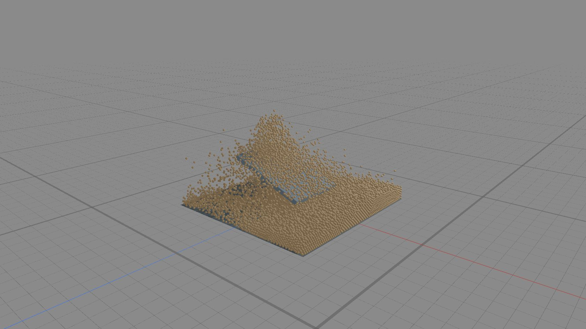

# Yoğun kuru grain — kurulum ve ölçüm, 2026-10-06

Kuru grain göz testi olarak kullanılabilir; üretim solver kabulü henüz tamamlanmadı.
Sand preseti tek başına ayrık grain solver açmaz; kuru olmak otomatik geçiş değildir.
Granular maddenin davranış modelidir; MPM/grain seçimi şu anda Matter domainindeki ayrı ayardır.

## Mevcut UI kurulumu

1. Matter domain: Vulkan, Closed, Sand preset.
2. Pore exchange/wet response, thermal liquid ve solid phase kapalı.
3. Dry Grain Solver (candidate) → Enable discrete grains açık.
4. Emitter → substance Sand, Initial Model Granular. Mevcut UI taşıyıcı kanalı Liquid;
   bu kanal adı fizik davranışının su olduğu anlamına gelmez.
5. Matter Output → Sand materyali/Splat; fizik tanesi başına tek sphere.
6. Fizik/grain parametrelerini değiştirmeden önce particles reset.

Hazır scene: `H1_Dense_Grain_Lab`, source `H1_Dense_Sand_Stream`,
flat ramp `H1_Dense_Ramp.001`; frame0 paused, source enabled. Play ile gözlenebilir.
4096/s istek, en fazla16384 tane,0–12 s kaynak; yer yoksa birth backlog ertelenir.
Kapalı domain tabanı ve ramp collider; fizik yarıçap .025 m (çap5 cm).
Başlangıç için sahne açık bırakıldı; proje save yapılmadı. Önceki fixturelar/Cube
kadraj dışına taşındı; özgün dönüşümler JSON loglarında korunur.

## Aynı profilde maliyet matrisi

Vulkan, voxel .10 m, h=.10 m,200 kN/m stiffness,Cn8 Ns/m,sliding4 Ns/m,
friction .5,rolling .02,twisting .1,max substeps4096. Domain max40000.
Tane kütlesi .200000003 kg; voxel/particles-per-cell kaynaklı mevcut parcel mass,
grain radius bunu değiştirmez. Radius/mass fizik profilinin bütünü henüz yeniden
tasarlanmadı; .15 voxel ile ilk ölçüm .646 kg/tane verdiği için bu tabloya karıştırılmadı.

0.5 s düşüş: dt1/60,30 adım; ilk5 ısınma dışı,25 örnek. Benchmark output hidden,
viewport Material. Tablo simulation stats medyan/P95; render FPS veya saf GPU zamanı değildir.
Yoğun rampalı steady-state/uzun settle ve bağımsız tekrarlı performans kabulü değildir.

| Fizik taşıyıcısı | Medyan ms/adım | P95 ms | Dispatch/adım | Dry mass drift |
|---:|---:|---:|---:|---:|
| 1,024 | 173.6 | 200.0 | 3471 | 0 kg |
| 4,096 | 213.8 | 262.8 | 3471 | 0 kg |
| 16,384 | 272.2 | 285.0 | 3471 | 0 kg |

Ayrı gerçek akış göz testi4.5 s/270 adımda16384 taneye ulaştı;
kütle3276.80005 kg, held-step yok. Akış devam ederken alınan görünüm, settle/repose kabulü değil.

Kanıt: `matter_h1_dense_grain_voxel010_measured_2026-10-06.json`,
`matter_h1_dense_grain_visual_full_live.json`. Tekrar:
`python scripts/test/rt_h1_dense_grain_scene_ipc.py`. Bu test sahnesi kurulum/ölçüm yapar,
save veya build yapmaz. Hata halinde active authoring restore edilir;
başarılı kurulumda yalnız bu deney sahnesi aktif kalır.

Açık işler: kalıcı static contact history/repose, phase/wet/heat coupling,
cache/scrub/resume matrisi, normal yolda full GPU residency ve production maliyet.
Fizik malzeme profili/solver seçimi/Output/Emitter UI göçü temel solverden sonra.
