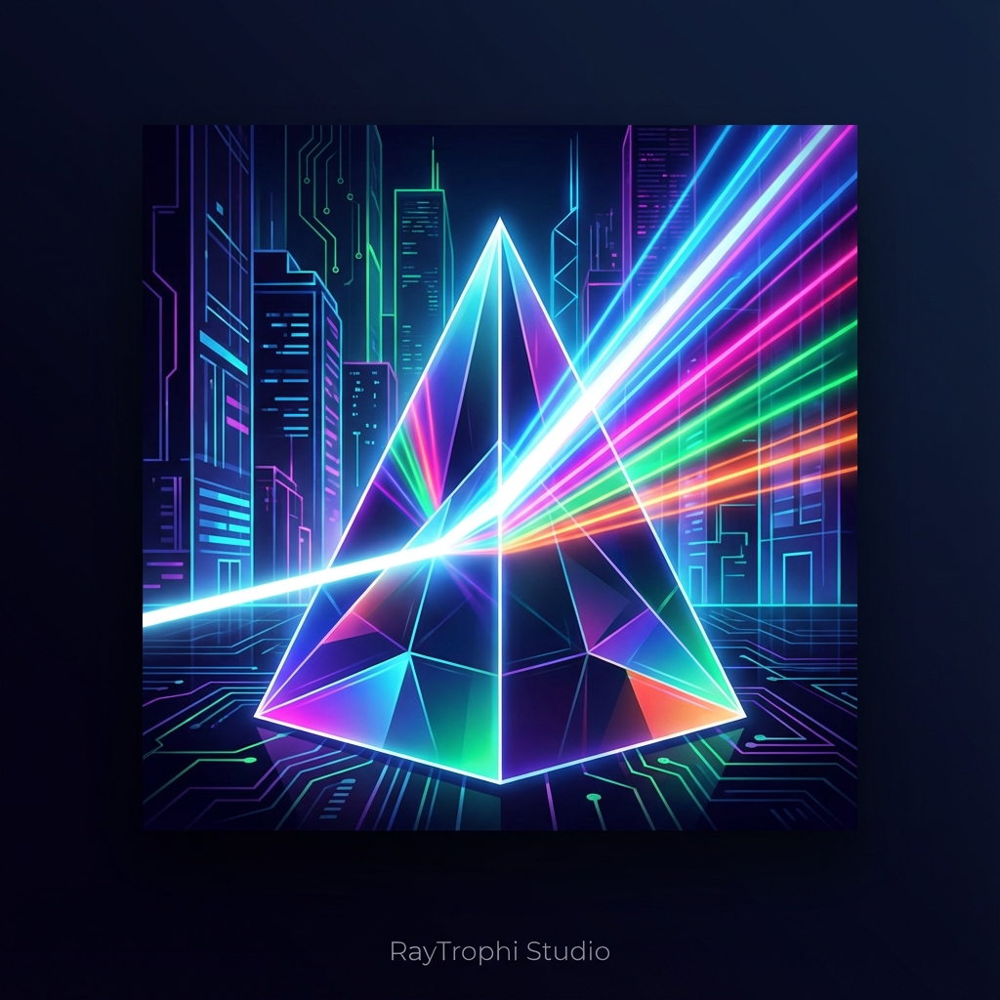

# RayTrophi - Advanced OptiX & Hybrid Ray Tracing Engine

RayTrophi is a high-performance, modular ray tracing engine built with **NVIDIA OptiX 7**, **SDL2**, **ImGui**, and **OpenVDB (NanoVDB)**. It bridges the gap between real-time preview and offline path tracing, offering advanced features like volumetric rendering, node-based terrain generation, and a complete animation timeline.

## 🚀 Key Features

### 🌪️ Gas & Fluid Simulation (NEW)
- **Physical Gas Solver:** GPU-accelerated fluid simulation (Smoke, Fire) with real-time feedback.
- **Force Fields:** Interact with simulations using Point, Directional, Vortex, Turbulence, and Drag forces.
- **Volumetric Rendering:** Dual-Lobe Phase function, Multi-Scattering, and Blackbody radiation for realistic fire/explosions.
- **OpenVDB / NanoVDB Support:** Import standard `.vdb` files and sequences for complex volumetric data.

### 🎬 Advanced Animation System
- **Animation Graph (AnimGraph):** State Machine based character animation logic (Idle -> Walk -> Run).
- **Blend Spaces:** Smoothly blend between animations based on parameters (e.g., Speed, Direction).
- **Timeline & Keyframing:** Animate Objects, Lights, Cameras, and World properties (Sky, Cloud Density, etc.).
- **Skinned Mesh Support:** GPU-accelerated skinning for character meshes.

### 🌍 Terrain & Foliage
- **Foliage Painting:** Paint millions of instanced objects (trees, grass, rocks) with optimized GPU Performance. Features brush radius, density, and alignment controls.
- **Terrain Node System (V2):** 
  - Hydraulic Erosion simulation.
  - Generative noise nodes (Perlin, Worley).
- **Water System:**
  - **FFT Ocean:** Real-time deep ocean simulation with whitecaps.
  - **River Tool:** Create flowing rivers using cubic bezier splines with flow maps and turbulence.
- **Atmosphere:**
  - Nishita Sky Model (Spectral Day/Night Cycle).
  - Volumetric Fog & God Rays.

### 🖌️ Scene Editor & Tools
- **Modern UI Overhaul:** Refined dark theme with organized panels for World, Terrain, Water, and Animation.
- **Interactive Gizmos:** Blender-style 3D manipulators for Translate, Rotate, and Scale.
- **Asset Management:** robust GLTF/GLB import support.
- **Documentation:** Built-in offline documentation with modern web interface.

### 🎨 Rendering Core
- **Hybrid Engine:** 
  - **GPU:** OptiX 7 (RTX Accelerated) Path Tracing with Instancing support.
  - **CPU:** Intel Embree / Parallel BVH Fallback.
- **Materials:** Principled BSDF (Disney), Glass, Metal, Emission, Volumetric.
- **Denoiser:** Intel OIDN integration for noise-free previews.

## 🎮 Controls

### Viewport Navigation
- **Orbit:** Middle Mouse Drag
- **Pan:** Shift + Middle Mouse Drag
- **Zoom:** Mouse Wheel or Ctrl + Middle Mouse Drag
- **Focus:** `F` (Focus on selected object)

### Tools & Edit
- **Select:** Left Click
- **Gizmo Modes:** `G` (Grab), `R` (Rotate), `S` (Scale)
- **Duplicate:** `Shift + Drag`
- **Delete:** `Del` or `X`
- **Undo/Redo:** `Ctrl+Z` / `Ctrl+Y`
- **Play Animation:** `Space`

### Rendering
- **Final Render:** `F12`
- **Animation Render:** (Via Render Panel)

## 🔧 Build Instructions
1. **Requirements:**
   - Visual Studio 2022
   - NVIDIA Driver (Latest)
   - CUDA Toolkit 11.x or 12.x
   - OptiX 7.x SDK
2. **Setup:**
   - Open `raytrac_sdl2.sln`
   - Ensure `vcpkg` dependencies are installed (SDL2, ImGui, Assimp, OIDN, OpenVDB/NanoVDB).
3. **Build:**
   - Select `Release` configuration.
   - Build Solution (`Ctrl+Shift+B`).
4. **Run:**
   - Launch `raytracing_render_code.exe` (or from VS Debugger).

## 📜 License
Developed by **Kemal DEMİRTAŞ**.
This project is for educational and portfolio purposes.
